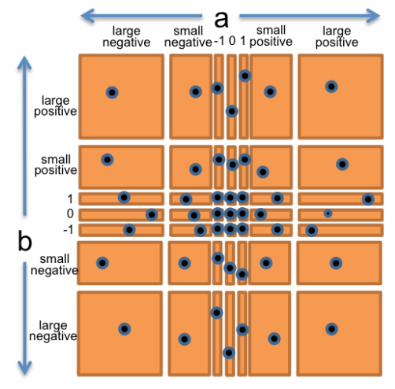

# Testing

## 목표

→ Testing 과목에서 알아야할 것

1. Testing의 중요성의 이해 - 테스트 우선 프로그래밍의 과정을 알아야함
2. input, output 공간을 분리하고 좋은 테스트 케이스를 선택하여 메서드를 위한test suite를 설계하는 것
3. code coverage를 측정하여 test suite 판단
4. 블랙 박스 테스트와 화이트박스를 사용해야할 때, 단위 테스트 통합 테스트 그리고 회귀 테스트에 대하여 이해하는 것

---

## Validation

→ 테스트는 `validation`(검증) 이라고 하는 일반적인 프로세스의 예시이다.

`validation`의 목적으로는 프로그램에서 보이지 않는 문제와 프로그램의 정확성에 대한 신뢰성을 높히는 것이다.

### **Formal reasoning(형식적 추론)** → 프로그램에서는 *`verification` 라고도 부름 :*

- *`**verification`은 프로그램이 정확한 공식적인 증명을 만들어낸다.***
- **손으로 하면 지루하기 때문에 자동으로 검증해주는 도구를 연구하는 분야는 활발하다.**
- **그럼에도 운영체제의 스케줄러, Virtual machine의 인터프리터 또는 운영체제의 파일 시스템처럼 작고 중요한 부분이 공식적으로 검증될 수 있다.**

`**Validation(유효성 검증)`:**

- **Validation은 주로 입력 데이터나 사용자 입력과 같은 외부 데이터의 유효성을 검사하는 것**
- **데이터의 형식, 범위, 제한 조건, 요구 사항등을 검사하여 데이터가 사용자의 기대와 일치하는지 확인**
- **예를 들어 사용자가 웹에서 이메일 주소를 입력하는 경우, 이메일 형식에 부합하는지 확인하는 것**

`**Verification(검증)`:**

- **Verification은 주로 소프트웨어의 특정 부분 또는 시스템이 명세에 따라서 동작하는지 확인하는 것**
- **코드의 실제 실행 및 동작을 검사하여 예상한 결과와 일치하는지 확인하는 것을 포함**
- **예를 들어 자바 코드에서 메서드를 작성하고 테스트 케이스를 사용하여 해당 메서드가 예상한 출력을 생성하는지 확인하는 것은 검증이다.**

**→ Validaiton은 데이터나 입력이 제대로 들어왔는지 검사하고 Verification은 소프트웨어가 제대로 동작하는지를 확인한다.**

### Code review

- **다른 사람이 나의 코드를 주의 깊게 읽고 이유를 찾아내는 것(효율이 있는지, 오류는 없는지)에 대한 것은 버그를 찾는 것은 좋은 방법일 수 있다. - (내가 쓴 에세이를 다른 사람이 교정해주는 것과 같은 것)**

### Testing

- **신중하게 입력값을 선택하고 결과가 맞는지 확인한다.**

**→ 좋은 검증을 거쳐도 완벽한 수준의 소프트웨어가 되는 것은 매우 어렵다.**

---

## Why Software Tesing is Hard(왜 소프트웨어 테스트는 어려운가)

- **Exhaustive testing is infeasible(철저한 테스트는 불가능하다): 모든 경우의 수를 테스트하는 것은 너무 크기가 크다. (ex. float 곱센 연산를 테스트 하기 위해서는 2^64개의 테스트 케이스가 있다.)**
- **무계획인 테스트(시도해보고 작동하는지 테스트)는 버그를 발견할 확률이 적다 : 프로그램에 버그가 너무 많아서 임의로 선택한 입력값이 성공 확률보다 실패할 가능성이 더 큰 경우를 제외하고는 계획을 짜고 테스트를 하지 않는다면 버그를 발견하기 힘들다.**
- **무작위 혹은 통계적 테스트는 소프트웨어랑 잘 맞지 않다 :**
    - 다른 분야에서는 작은 테스트 케이스로 전체적인 결함률을 추론 할 수 있다.
    - 그러나 소프트웨어 입력은 메모리 등 공간에 따라 불연속적이고 이산적으로 다양하다.
    - 잘 동작하다가도 어느 경계 지점에서 **갑자기 실패 할 수 있다.**

---

## ****Putting on Your Testing Hat****

→ 프로그래밍의 목표는 잘 작동하는 것이 목표이지만 테스트할 땐 그것을 실패하게 해야한다.

→ 좋은 테스트는 프로그램이 취약 할 수 있는 곳을 모두 테스트하여 취약점을 전부 제거해주어야한다.

---

## ****Test-first Programming****

→ 초기에 테스트를 자주해야한다. 코드가 검증되지 않았다면 테스트가 끝날 때까지 방치하면 안된다.

→ 테스트가 끝날 때 까지 방치하면 디버깅 시간이 길어지고 고통스러워진다.(버그는 어디에나 있을 수 있음)

→ 그렇기 때문에 코드를 개발하면서 테스트 하는 것이 훨씬 효율적이다.

- 테스트 우선 프로그래밍은 개발을 하기도전에 테스트 코드를 작성한다.

**테스트 우선 프로그래밍 순서도**

1. 함수에 대한 기능 적기
2. 기능을 수행하는 테스트 작성
3. 실제 코드 작성, 코드가 작성된 테스트 코드를 통과하면 완료한 것이다.

- `**specifcation`에는 잘 작동 했을 때 입력값과 결과값을 명시한다.**
- **매개변수에 대한 유형과 추가 제약조건을 작성한다.(ex.  sqrt의 매개변수는 음수가 아니여야한다.)**
- **리턴 타입과 입력값에 연관성을 적어놓는다.**
- **코드에서는 메소드 시그니처에 대한 설명과 메서드가 수행하는 기능에 대하여 적는다.**

**→ 테스트 코드를 먼저 작성하는 것은 `specification(요구사항 명세서)`를 이해하기 좋은 방법이다.** 

**specification에는 버그(부정확성, 미흡, 애매모호함, `corner cases`가 빠짐)가 많을 수 있다.**

**→ 테스트 코드를 먼저 작성한다면 이러한 버그 스펙을 완성하는데에 대한 시간 낭비를 줄일 수 있다.**

### 💡

`**Edge case/ 경계조건` : 문제나 극한의 상황(입력값이 Min 혹은 Max)등을 의미함(ex. 스피커 볼륨 MAX → 소리 왜곡)**

**→ 메서드가 기능을 제대로 수행하는지에 대한 `unit test`를 돌릴 때 최소/최대 값, 즉 `경계(edge)값`을 넣어 테스트 하는 것(엣지 케이스 테스트)**

**→ 이 범위가 성공하면 다른 값도 정상 동작한다는 동작 범위와 신뢰할 수 있는 코드라는 의미를 줌**

**`Corner case / 복합 경계 조건` : `edge case`를 만족하면서 외부 변수나 특정 조건에서 문제가 발생하는 경우**

Ex**) 앞서말한 스피커가 정상 동작하더라도 온도, 습도등이 일정 범위를 벗어나면 문제가 발생한다.**

**→ 이러한 문제는 발견하기 쉽지 않다는 문제가 있음**

---

## ****Choosing Test Cases by Partitioning****

**→ 좋은 `test suite`를 만드는 것은 어렵고 흥미로운 설계이다.**

**→ 우리는 프로그램을 검증 할 수 있을만큼 충분히 크지만 작고 빠르게 작동하는 `test case`를 선택하고 싶다.**

- **그러기 위해서는 입력 값으로 구성된 하위 도메인으로 입력 공간을 나눈다.**
- **함께 사용한다면 도메인이 입력 공간을 완전히 덮으므로(?) 최소한 한개의 도메인을 이용하도록 한다.**
- **그 후 각 하위 도메인에서 한개에 `test case`를 선택한다. 그것이 `test suite`**

`**test case`: 각각의 테스트 모듈**

`**test suite`: test case를 관계별로 묶어놓은 것 → test case의 집합**

`**Preconditions` : 테스트를 실행하기 전에 특정 조건이나 상태가 충족되어야 하는 경우**

**ex) sqrt 메서드가 있으면 음수를 입력 받으면 안됨** 

`**Postconditions` : 테스트가 실행된 후에 예상되는 결과나 상태를 명시한다. 즉, 테스트 종료시 시스템이 어떤 상태여야 하는지를 기술한다.**

**ex) 두개의 정수를 더해 결과를 반환하는 메서드가 있다면 함수의 반환값이 두 정수를 더한 값과 같아야 한다.**

### Subdomain idea

**→ 유사한 동작을 하는 입력값들로 분할 하는 것. 그 다음 그 세트에 대표 값을 구한다. 이러한 접근 방법은 서로 다른  `test case`를 사용하고 Random 값으로 접근 할 수 없는 부분을 확인함으로서 제한된 테스트 자원을 최대한 활용한다.**

## ex) BigInteger.multiply()

**→ `BigInteger`은 범위를 갖는 Int나 long와 같은 primitive type들과 달리 모든 크기의 정수를 나타낼 수 있다.**

```java
/**
 * @param val  another BigIntger
 * @return a BigInteger whose value is (this * val).
 */
public BigInteger multiply(BigInteger val)

// 사용법은 이렇다.
BigInteger a = ...;
BigInteger b = ...;
BigInteger ab = a.multiply(b);
```

**→ 여기서 보이는 `multiply`는 인자가 하나처럼 보이지만 사실은 a와 b두개를 받는 메서드이다. a의 메서드이므로 this를 활용하여 푸는 것이다.(파이썬의 self와 같음)**

**그러므로 우리는 두개의 입력값(`BigInteger`)을 취하고 하나의 결과값(`BigInteger`)을 출력하는 것으로 생각 할 수 있다.**

```java
**multiply : BigInteger × BigInteger → BigInteger**
```

→ 그러므로 우리는 정수쌍을 갖는 2차원의 `input space`를 갖게된다.

**생각 할 수 있는 경우의 수**

- a, b 둘 다 양수
- a, b 둘 다 음수
- a는 양수 b는 음수
- a는 음수 b는 양수
- a 또는 b가 0, 1 또는 -1

 **`int`나`long` 등으로 표현하기에 너무 큰 값일 때, 즉 `long` 보다 큰 정수도 가능한지 확인해야함**

- a 또는 b는 작다.
- a 또는 b의 값이 `Long.MAX_VALUE`로 자바에서 가능한 가장 큰 정수 2^63보다 큼

**나올 수 있는 경우의 수가 나왔음으로 전체 공간의 간단하게 분할 할 수 있다.(a,b) 독립적으로 선택 가능**

- **0**
- **1**
- -**1**
- **작은 양의 정수**
- **작은 음의 정수**
- **거대한 양의 정수**
- **거대한 음의 정수**

**→ 그러므로 나올 수 있는 경우의 수를 포함하는 7 x 7 = 49개의 파티션을 생성했다.**



**: 점들은 test case를 완전히 커버하기 위해서 선택한 것**

**test suite를 생성하기 위해서 우리는 그리드의 사각형에서 임의로 값의 쌍(a,b)를 선택한다.**

**ex)** 

(a,b) = (-3, 25) to cover(small negative(작은 음수),small positive(작은 양수))

(a,b) = (0, 30) to cover( 0, small positive(작은 양수))

(a,b) = (2^100, 1) to cover(large positive(큰 양수), 1))

등등..

## Example: max()

→ 다른 경우인 `Math.max()` 함수이다.

```java
/**
 * @param a  an argument
 * @param b  another argument
 * @return the larger of a and b.
 */
public static int max(int a, int b)

max : int x int -> int
```


**기술서에 따른 합리적인 분할**

- a < b
- a = b
- a > b

**test suite**

- (a, b) = (1, 2)to cover a < b
- (a, b) = (9, 9)to cover a = b
- (a, b) = (-5, -6)to cover a > b

## Include Boundaries in the Partition

→ 경계에서도 버그는 발생한다.

**ex)**

- 0은 양수와 음수의 경계이다.
- 숫자 유형의 최대값과 최소값 - `double`, `int`
- Collection type의 empty 경우
- 첫번째와 마지막 원소

**→ 경계값에서 자주 오류가 찾아지는 이유는? 프로그래머가 실수함( ex. ≤ 대신 < 또는 1이 아닌 0으로 초기화)**

**경계값 처리를 포함한 max 값 분류**

- *a와 b의 관계*
    - a < b
    - a = b
    - a > b
- *a의 값*
    - a = 0
    - a < 0
    - a > 0
    - a = minimum integer
    - a = maximum integer
- *a의 값*
    - b = 0
    - b < 0
    - b > 0
    - b = minimum integer
    - b = maximum integer
    

**→ 이제 여기서 `test suite`를 선택한다.**

- (1, 2) covers a < b, a > 0, b > 0
- (-1, -3) covers a > b, a < 0, b < 0
- (0, 0) covers a = b, a = 0, b = 0
- (Integer.MIN_VALUE, Integer.MAX_VALUE) covers a < b, a = minint, b = maxint
- (Integer.MAX_VALUE, Integer.MIN_VALUE) covers a > b, a = maxint, b = minint

### ****Two Extremes for Covering the Partition****

→ input space를 나눈 후 우리는 test suite가 얼마나 정확한지 선택 할 수 있다.

- **Full Cartesian product(완전 데카르트 곱) : 두개 이상의 집합을 모두 조합하여 가능한 모든 조합**
    - **파티션 크기의 모든 가능한 조합은 하나의 테스트 케이스로 처리된다. `multiply` 예제에서 7 x 7 = 49개의 테스트 케이스를 제공한다.**
    - **만약 3개, 5개, 5개로 구성된 3차원일 경우 max는 최대 3 x 5 x 5 = 75개의 테스트 케이스를 의미한다.**
    - **그러나 실제로 이러한 경우가 모두 가능하지 않다.(ex. a < b, a = 0, b = 0인 경우)**
- **Cover each part : 프로그램의 모든 부분, 경로, 조건, 상황을 테스트하는 것**
    - **각 차원은 최소한 하나의 테스트 케이스를 다루지만 모든 조합이 필요한 건 아님**
    - **이러한 접근법으로 `max` 에서  `test suite`를 선택할 때 5가지만 골랐음**

예시 ) 

- **문장 또는 함수 호출의 모든 조건:** 코드의 각 조건문과 제어 흐름 경로를 테스트하여 모든 조건이 충족되고, 예외적인 상황도 고려될 수 있도록 한다.
- **함수 및 메서드 호출**: 모든 함수 또는 메서드 호출은 확인하고 각 호출시 입력 값이 올바르게 전달되고 반환값이 올바르게 처리되는
- **예외 상황 처리 :** 코드가 예외 상황을 올바르게 처리하고 무결성을 유지하는지 확인한다. 이러한 예외 테스트는 비정상적인 상황에서 코드 동작을 검증하는데 중요하다.
- ****************************루프와 반복 :**************************** 반복문을 모든 가능한 반복 경로를 따라 테스트하여 코드가 올바르게 반복하고 종료하는지 확인
- **********************************************************모든 변수와 데이터 구조 :********************************************************** 코드에서 사용되는 모든 변수와 데이터 구조를 테스트하여 데이터의 일관성과 정확성을 확인한다.

### 두가지의 차이점

- `**Full Cartesian product`는 데이터 조합 또는 입력값 조합의 개념으로 사용되며 여러 가지 입력 변수 또는 요소를 조합하여 가능한 모든 입력 조합을 생성하는데 사용**
- `**Cover each part` 코드의 경로,조건 함수, 변수, 예외 상황등을 확인하여 코드의 테스트 커버리지를 확보하는 것을 목표함.**

**→ `Full Cartesian product`는 입력 조합을 생성하거나 다차원 공간에서 조합을 생성하는 데 사용되고 `Cover each part`는 코드 테스트를 위한 것으로 코드의 모든 부분을 테스트 하는 것**

---

## ****Blackbox and Whitebox Testing****

**→ 지금까지는 함수의 동작(파라미터 타입, 리턴 타입, 제약조건 등)에 대한 설명이였다.** 

**`Blackbox testing`: 기능 구현이 아닌 기능 그 자체에 대해서 생각한다. 위에서 예시로 나온 `multiply`, `max` 처럼 이러한 기능에 대한 코드는 보지않고 기능만 주시함.**

**`Whitebox testing` : 기능이 실제로 어떻게 구현되는지에 대한 지식을 바탕으로 테스트 케이스를 선택하는 것.**

**ex) 구현시 입력에 따라 다른 알고리즘을 선택하는 경우 경우에 따라 도메인으로 분할해야한다.** 

**`화이트박스 테스트`를  진행 할 때는 테스트 케이스에 기술서에서 특별히 요구하지 않는 행동을 구현하는지 확인해야한다. → 예를 들어 기술서에 “입력 형식이 잘못된 경우 예외가 발생한다.”고 명시되어 있는 경우 현재 수행하는 작업이기 때문에 테스트를 구체적으로 확인 할 필요는 없다.**

---

## ****Coverage****

→ `**test suite`를 판단하는 한가지 방법은 프로그램이 얼마나 철저하게 실행하는지 보는것이다.**

**→ 이러한 개념을 `coverage`라고 한다.**

`**Test Coverage` : 소프트웨어 테스트의 품질 및 완성도를 측정하는데 사용되는 방법 중 하나. 특정 소프트웨어 코드가 얼마나 많은 부분을 테스트하는지를 나타낸다.**

**3가지 커버리지:**

- **Statement coverage:** 모든 명령문이 일부 테스트 케이스로 실행되는가? 즉, 모든 문장을 얼마나 많이 실행하는지를 측정 → 코드 내 실행 경로를 다루는 데 도움된다.
- **Branch coverage:** 프로그램에 모든 `if` 또는 `while` 문에 대해서 일부 테스트 케이스에서 `true` 와 `false` 인 경우를 모두 확인하는가? 코드의 모든 조건문이 참과 거짓으로 평가되는지 확인하는 데 사용된다.
- **Path coverage:** 일부 테스트 케이스에서 모든 가능한 경로 조합(if, while문)을 확인하는가?

**→ `Branch coverage`(더 많은 테스트가 필요하다)는 `statement coverage` 보다 강력하다.**

**→ `Path coverage`는 `Branch coverage` 보다 강력하다.**

**산업에서는 100% Statement Coverage를 성취하는것이 목표이지만 대게 defensive code(방어코드)로 인해 도달되지 않는다.**

**→ 100% branch coverage는 가장 바람직하며 안전이 중요한 산업 코드는 훨씬 기준이 엄격하다.**

`**defensive code` : 예쌍치 못한 입력에도 소프트웨어가 계속 기능 수행을 보장할 수 있도록 고안된 방어적 설계**

**But, 100% 경로 적용은 불가능하므로 이를 달성하기 위해서는 엄청난 크기의 test suite가 필요하다**

- **테스트의 가장 표준적인 접근법으로는 test suite가 적절한 `statement coverage`를 달성할 때 까지 테스트를 추가하는 것이다. 즉, 프로그램에서 사용 할 수 있는 명령문이 최소한 한번은 실행하도록 하는것이다.**
- **실제로 `statement coverage`는 보통 code coverage tool에서 `test suite`에 의해서 각 명령문이 실행되는 횟수를 계산하는 도구로 측정된다.**

---

## ****Unit Testing and Stubs****

**→ 잘 테스트 된 프로그램은 모든 개별 모듈(메서드 혹은 클래스) 테스트를 가진다.** 

**→ 가능하다면 개별적으로 모듈을 분리해서 테스트하는 것은 `unit test` 라고 한다.**

- **모듈을 분리하면 테스팅이 훨씬 쉬워진다.**
- **unit test에서 모듈이 실패한 경우 프로그램 전체가 아니라 해당 모듈에서 버그가 발생했다고 생각 할 수 있다.**

### integration test

**→ `unit test` 반대, 모듈의 통합, 혹은 전체 프로그램을 테스트한다.**

**→ `integration test` 만 있다면 프로그램 전체에서 버그를 찾아야한다. 프로그램 어딘지 모름**

**하지만 모듈이 연결되면서 오류가 발생한 걸 수 있으므로 `integration test`는 여전히 중요**

**ex) 한 모듈이 다른 모듈로부터 받는 입력값이 기대와 다를 수 있음**

**→ 그러므로 unit 단위로 신뢰성을 보장해주는 `unit test` 가 있다면 버그를 찾기 위해 고생 할 수고를 덜 수 있음**

**ex) 웹 검색 엔진을 구축한다고 가정 할 때 두가지 모듈이 있다고 가정하자**

`**getWebPage()`: 웹 페이지를 다운로드하는  모듈**

`**extractWords()`: 페이지를 구성 단어로 분할하는 모듈**

```java
/** @return the contents of the web page downloaded from url 
 */
public static String getWebPage(URL url) {...}

/** @return the words in string s, in the order they appear, 
            where a word is a contiguous sequence of 
            non-whitespace and non-punctuation characters 
 */
public static List<String> extractWords(String s) { ... }
```

`**makeIndex()` : 검색 엔진의 index를 만드는 웹 크롤러의 일부(다른 모듈에서 사용 할 수 있음)**

```java
/** @return an index mapping a word to the set of URLs 
            containing that word, for all webpages in the input set 
 */
public static Map<String, Set<URL>> makeIndex(Set<URL> urls) { 
    ...
    for (URL url : urls) {
        String page = getWebPage(url);
        List<String> words = extractWords(page);
        ...
    }
    ...
}
```

****************************************************test suite에서 우리가 원하는 것****************************************************

- `**getWebPage()` : 다양한 URL에서 테스트하기 위한 unit test**
- `**extractWords()` : 다양한 문자열에 대한 테스트를 위한 unit test**
- `**makeIndex()` : 다양한 URL이 있는 set에서 테스트하기 위한 unit test**

**개발자들이 자주 실수하는 것 중 하나는 `extractWords()` 테스트 케이스를 쓸 때 정확도를 위해서 `getWebPage()`에 의존해야한다고 생각한다.**

1. **하지만 별도로 생각하고 분리해서 테스트하는게 좋음**
2. **웹 페이지 콘텐츠를 포함해서 `test partitions`를 짜는게 좋을 순 있음.** 
3. **But `getWebPage()` 에 버그가 있을 수 있다.**
4. **그러므로 테스트에선 웹 페이지 콘텐츠 대신 리터럴 문자열을 저장해서 직접 넘기는게 낫다.**

**→ 이렇게 하여야 테스트도중 실패할 때 그 모듈에 문제가 있다는 걸 바로 알 수 있다.**

### makeIndex()

→ `makeIndex()`의 unit test는 위와 같은 방법으로 쉽게 분리 될 수 없다.

→ 이는 내부 코드뿐만 아니라 호출하는 메서드에 정확도도 테스트된다.

<aside>
💡 **오류가 발생시 makeIndex() 오류뿐만이 아닐 수 있기때문에 나머지 메소드의 unit test를 하는 것이다**

</aside>

`**makeIndex()` 와 같은 상위 수준의 모듈은 호출하는 모듈의 `stub` 버전을 작성하면 분리 할 수 있다.**

**ex) `getWebPage() Stub` 은 인터넷에 직접 접근하지않지만 URL을 통하지 않고 `mock web page content` 를 전달 할 수 있다.**

**→ 클래스의 stub는 종종 `mock obejct`라고 부름**

→ stub는 대규모 시스템을 구축하는데 중요한 기술이지만 6.005에서는 사용하지 않음

`**Stub` : 테스트 용도로 하드 코딩한 값을 반환하는 클래스를 의미함**

→ **주로 external service(database, web service)를 사용하는 코드를 테스트 할 때 사용**

**→ 우리는 external service를 call 할 수 있는지에 대해 test 하고 싶은게 아니기 때문에 하드코딩으로 대체하고 테스트하고자 하는 비즈니스 로직에 집중한다.**

**Stub를 사용함으로 의존하는 것 없이 기능에 집중하여 개발/테스트가 가능하다.**

`**mock obejct`:  실제 사용하는 모듈을 사용하지 않고 실제 모듈을 흉내내는 “가짜” 모듈을 작성하여 테스트의 효율성을 높이는데 사용하는 객체**

**→ 사용자 인터페이스(UI)나 데이터베이스 테스트등과 같이 자동화된 테스트를 수행하기 어려울 때 사용함**

**→ DB 같은 곳에 접근하지 않기 때문에 테스트 시간도 줄이면서 불필요한 리소스 소비를 막고 객체의 행동까지 테스트 할 수 있음**

### Stub Vs. Mock

→ 차이점이 있는데 간략하게 정리해봄

1. **목적:**
- **Stub: 호출된 함수나 메소드가 어떻게 동작해야하는지에 대한 최소한의 동작만 정의**
- **Mock: 호출된 함수나 메소드에 대한 상세한 동작을 추적하고 검증하는 데 사용, 메소드 호출을 기록하고 호출된 메소드가 올바르게 호출되었는지 확인 등 → 즉, Mock가 Stub보다 더 상세한 동작을 테스트하기 위해 사용된다.**
1. **구현:**
- **Stub: 주로 정적이고 간단한 방식으로 구현됨. 항상 동일한 값을 반환 혹은 미리 정의된 동작 수행**
- **Mock: 호출된 메소드에 대한 세부 동작을 추적하고 검증하기 위해서 복잡한 로직으로 구현**
    
    **→ 호출 횟수, 매개변수 값, 호출 순서 등 기록하고 검증**
    
1. **검증:**
- **Stub: 검증보다는 특정 상황에서 어떤 값을 반환해야하는지가 중점**
- **Mock: 호출된 메소드의 호출 횟수, 매개변수 값 및 호출 순서와 같은 세부 정보를 검증, 예상대로 동작하는지 확인**
    
     
    

**결론:**

`**Stub`: 단순한 대체품으로 결과 값을 고정하는 상태**

`**Mock`: 호출된 메소드에 대한 세부 동작을 추적하고 검증하는 행위**

---

## ****Automated Testing and Regression Testing****

**→ 완전한 자동화보다 테스트를 더 쉽게 실행하고 실행 가능성을 높이는 것은 없음**

- `**Automated testing` 은 테스트를 실행하고 결과를 자동으로 확인해주는 것을 의미함.**
- **test driver은 입력값과 결과를 확인하도록 출력하는 interactive program이 되면 안됨**
- **그 자체에서 모듈을 호출하고 결과가 올바른지 자동으로 확인 해야함(Junit 했던 것 처럼)**

### **테스트를 마치면 코드를 수정 할 때 테스트를 다시 실행해주어야함 !**

**→ 새로운 버그를 수정하거나 새로운 기능을 추가할 때 다른 버그가 발생하는 것을 방지해야 함**

**모든 수정마다 모든 테스트를 실행하는 것을 `regression testing` 라고 한다.**

- **버그를 찾아 수정할 때 마다 버그를 유발하게 한 입력 값을 `test suite`에 `test case`로 추가 해주어야 한다.**
- **이런식으로 한다면 `test-first debugging` 으로 이어진다. 버그가 발생한다면 즉시 해당 버그를 유발하는 `test case`를 작성해서 `test suite`에 추가한다. 버그를 찾고 수정하면 모든 테스트 케이스가 통과하며 디버깅이 완료되고 해당 버그에 대한 `regression testing`가 생성된다.**

**→ 실제로는 `automated testing` 와 `regression testing`는 대부분 혼합해서 사용함**

**→ 회귀 테스트는 테스트를 자동으로 자주 실행할 수 있는 경우에만 실용적이다.** 

**반대로 `automated testing`가 이미 프로젝트에 준비되어있다면 회귀를 방지할 수 있다.**

---

## 요약

→ testing을 통해 배운 것

- **Safe from bugs:  테스트는 코드에서 버그를 찾는 것이고, 테스트 우선 프로그래밍은 버그를 가능한 빨리 찾는 것이다.**
- **Easy to understand : 테스팅은 코드리뷰만큼 도움이 되지않는다.**
- **Ready for change:  스펙의 동작에만 의존하는 테스트를 작성해서 변경을 고려했다. 또한 코드가 변경 될 때 버그가 발생하는 것을 방지하는데 도움되는 `regression testing에 대해서도 이야기 했음`**