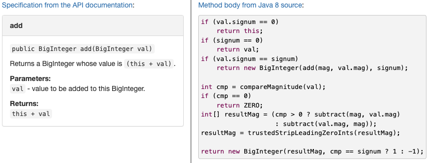

# Reading 6: Specification

# 서론

## Keywords

- Method Specification
- Precondition, Postcondition
- Exception

## Introduction

- Specification은 협업에서 가장 중요한 요소이므로 이 없이 Method를 구현하는 것은 불가능함
- 이는 Implementor와 Client의 계약과 같은 것이므로 이를 이행하고, 의존하여 사용할 책임이 있다
- 이를 통하여, Method의 Interface를 버그로부터 안전하고 이해하기 쉽도록 작성할 수 있음

---

# Part 1: Specification

프로그램에서 발생하는 가장 심각한 버그들은 두 코드 사이의 동작에 관하여 이해하지 못한 것에서 발생함

- 모든 프로그래머가 생각하는 Specification이 존재하지만, 모든 프로그래머가 이들을 명시하지 않음
- 결과적으로 이는 팀 내의 다른 프로그래머들이 Specification에 대한 다른 생각을 가지고 있게 함

### Specification이 존재한다면

- 프로그램이 실패할 때 에러를 찾고 해결하기 쉬우며 코드로 책임을 돌릴 수 있다
- 코드 조각이 어떤 동작을 수행해야 하는지 명확하게 정의되며, 코드 변경이 필요한 경우 어떤 부분을 수정해야 하는지 쉽게 파악할 수 있다는 뜻
- 사용자 입장에서 코드를 읽을 수고로움을 덜어 줌. Specification을 읽는 것이 코드를 읽는 것보다 더 쉽기 때문임



- `BigInteger.add()` 에서 만약 코드의 동작에 대한 궁금증이 있었다면, 코드에서 직접 Constructure를 비롯한 다양한 메서드를 일일이 찾아봐야 했을 것임

- Implementor 입장에서는 사용자에게 알리지 않고 구현을 변경할 수 있는 자유를 주기 때문에, 코드를 더 빠르게 만들 수 있다


또한 이는 Client와 Implementor 사이의 방화벽 역할을 한다

- Client가 Specification을 가지고 있다면, 소스 코드를 읽을 필요가 없으므로 Unit의 세부적 작동 정보로부터 보호해준다
- Implementor는 해당 Unit을 사용하는 모든 Client에게 장치의 사용 계획과 같은 세부 정보를 일일이 물어보지 않아도 된다
- 이러한 Firewall이 분리를 초래하여 Unit의 코드와 Client의 코드를 독립적으로 변경할 수 있게 한다 (!)
  - 단, 각각의 의무를 준수하는 한(Specification)
  - **입력만 알고, 출력만 알면 된다!!**

# Behavioral Equivalence

```java
static int findFirst(int[] arr, int val) {
    for (int i = 0; i < arr.length; i++) {
        if (arr[i] == val) return i;
    }
    return arr.length;
}
```

```java
static int findLast(int[] arr, int val) {
    for (int i = arr.length -1 ; i >= 0; i--) {
        if (arr[i] == val) return i;
    }
    return -1;
}
```

**이를 결정하는 중요한 요소는, 한 Implementation을 다른 것으로 대체가 가능한 지 보아야 하는 것**

### 위 두 코드 동작의 차이점

- `val` 을 찾지 못했을 때?
  - `findFirst` → `return arr.length`
  - `findLast` → `return -1`
- `val` 이 두 개 존재할 때?
  - `findFirst` → 앞에서 가장 가까운 index
  - `findLast` → 뒤에서 가장 가까운 index

### 위 두 코드 동작의 공통점

- `val` 이 단 하나 존재한다는 가정이 있는 경우
  - 두 메서드 모두 해당 index를 return하는 동일한 동작을 가짐
  - Client의 경우, 이 외의 경우에서의 동작은 생각하지 않을 것임

이러한 경우, 두 Method는 동일하며 한 Implementation을 다른 것으로 대체가 가능함

## 결론

위와 같은 동등성(Equivalence)에 대한 개념은 보는 사람(Client)의 눈에 따라 달렸다

→ 한 Implementation이 다른 것으로 대체될 수 있도록 하기 위해, 또한 언제 이것이 받아들일 수 있는지 알기 위해 우리는 Specification이 필요함

### Behavioral Equivalence를 만족하는 경우

```java
static int find(int[] arr, int val)
  requires: val occurs exactly once in arr
  effects:  returns index i such that arr[i] = val
```

`if` 다음과 같이 Spec이 바뀐다면 어떻게 될까?

```java
// Client가 오직 Method가 반환하는 것에만 관심이 있다
return: any index i such that a[i] == val, if val is in a
				otherwise, any integer j such that is not a valid array index
```

- 두 Method 모두 `val` 이 Array 안에 있을 때의 동작은 동일하다
- 존재하지 않는 경우 두 Method 모두 Invalid array index(`array.length`, `-1`) 을 return 한다

따라서 위 Spec의 경우에도 Behavioral Equivalance는 동일함

# Specification Structure


### Precondition

- Client(Method를 호출하는 사람)의 의무
- Method가 호출되는 상태에 대한 조건

### Postcondition

- Implementor(Method를 Implement하는 사람)의 의무
- Method의 Precondition이 유지된다면 이는 Postcondition을 이행할 의무가 있다
  - 적절한 값을 Return, 지정된 Exception을 발생, Object를 수정 등..

### 전체적인 구조는 logical implication이다

- What is Logical Implication?
  “만약 … 이면 … 이다” 처럼 조건이 충족되면 결론이 유도됨을 나타냄
  “오늘이 토요일이면, 내일은 일요일이다”
- Precondition이 만족되었다면? → Method가 종료될 때 반드시 Postcondition을 만족하여야 한다

### 만약 Precondition을 만족시키지 못했다면?

- Implementation은 Postcondition을 구속하지 않는다
  - 이 경우, 어떤 구현을 하든 구현자의 자유이다
  - 종료시키지 않거나, Exception을 발생시키거나, 임의의 값을 Returning하거나, 임의의 수정을 하는 것
  - 왜냐하면 반드시 Precondition은 지켜져야 하는 규칙과도 같은 것이기 때문

### Example

```java
static int find(int[] arr, int val)
  requires: val occurs exactly once in arr
  effects:  returns index i such that arr[i] = val
```

1. if `arr` is empty, return 0
2. if `arr` is empty, throw an exception
3. if `val` occurs twice in `arr`, throw an exception
4. if `val` occurs twice in `arr`, set all the values in `arr` to zero, then throw an exception
5. if `arr` is not empty but `val` doesn’t occur, pick an index at random, set it to `val`, and return that index
6. if `arr[0]` is `val`, continue checking the rest of the array and return the highest index where you find `val` (or 0 if you don’t find it again)

_Precondition_ → val occurs exactly once in `arr`

→ 모든 경우에(1-6) Precondition이 지켜지지 않았다

→ Implementation이 Postcondition을 제한하지 않음(자유로운 처리가 가능함)

# Specification in Java

몇몇 언어는 Precondition과 Postcondition을 Language의 근본적인 부분으로 통합함

```java
...
   require
       n >= 0
...
```

다음과 같은 expression으로 Specification을 작성하면, Runtime 혹은 Compile Time에 자동적으로 Client와 Implementer 사이의 계약(Precondition, postcondition)을 검사해줌

### In Java

- Java의 경우 Static Type Declaration은 사실상 Method Precondition과 Postcondition의 일부
- 여기서 나타낼 수 없는 **Contract**의 경우 주석에 표시해야 하고, 다른 사람이 이를 보고 확인하는 작업이 필수적

Specification

```java
static int find(int[] arr, int val)
  requires: val occurs exactly once in arr
  effects:  returns index i such that arr[i] = val
```

Rendered in Java (Javadoc)

```java
/**
 * Find a value in an array.
 * @param arr array to search, requires that val occurs exactly once
 *            in arr
 * @param val value to search for
 * @return index i such that arr[i] = val
 */
static int find(int[] arr, int val)
```

parameter (precondition) → `@param`

result (postcondition) → `@return` `@throws`

→ Java에서는 이러한 요소들을 Statically Check할 수 없기 때문에 명시해 두고 이를 확인하여야 한다

# Null Reference

Java에서 Object에 대한 Reference와 Arrays는 특별한 값인 `null` 을 가질 수 있음

→ Reference의 경우, Object를 가리키지 않는 것을 의미함

→ Null Value는 Java의 Type System에서의 단점 중 하나이다

- Primitive type은 null이 될 수 없음 → Static Error
- Non-Primitive variable에는 null 할당 가능
  - `String name = null;` `int[] points = null`
  - Compile time에는 이를 별다른 Error로 판단하지 않음
  - Runtime에 `name.length()`, `points.length` 와 같은 instance method, field를 사용하면 Error

### Null is not equal Empty String or Array

- Empty String or Array → length is 0(zero)
- Point to Null String or Array → `NullPointerException`

## 되도록이면 Avoid Null 하는 것이 좋음

- Null Value는 매우 번거롭고, 안전하지 않기 때문에 제거하는 것이 좋음
- 또한, Parameter와 Return value로 암시적으로 허용되지 않음
- 따라서, 모든 Method들의 Obejct or Array의 Parameter로 null을 가질 수 없다는 Precondition을 가짐

- 또한, 이를 Return하는 Method에서 이들이 Null이 아니라는 Postcondition을 가짐
- 만약 Null를 가질 수 있다면? 반드시 명시해주어야 함

```java
static boolean addAll(@NonNull List<T> list1, @NonNull List<T> list2)
```

→ Java의 Extension으로 Type Declaration에 Null을 금지하도록 설정할 수 있음

→ 이 Annotation을 하면, Compile time or Run time에 자동적으로 체크해 준다

### 학자들의 연구 결과

- 부주의한 Null의 사용은 엄청 다양한 버그를 발생시킬 수 있음
- 구글 코드 베이스를 연구한 결과, 95%의 Collections의 경우 어떠한 Null을 사용하지 않아야 하며, 이를 허용하는 것보다 Fail Fast하도록 하는 것이 훨씬 더 도움을 준다
- 또한 Null은 모호함(무엇을 의미하는 지 명백하지 않음)
  - `Map.get(key)` 가 Null을 Return했을 때?
    - map 안에 있는 value가 null일 때
    - value가 map 안에 없을 때

# Testing and Specification

Specification만 두고 테스트하는 블랙박스 테스트와 실제 구현에 대한 지식을 가지고 테스트하는 화이트박스 테스트

하지만, 화이트박스 테스트의 경우에도 반드시 Specification을 따라야만 한다

- 당신의 구현이 Specification이 요구하는 것보다 더 강력한 보장을 제공할 수도 있고, 여기서 제공하지 않는 특정 동작을 가질 수도 있음
- 하지만 테스트 케이스는 그런 행동에 의존하면 안되고, 모든 Client와 마찬가지로 반드시 Contract를 이행해야 한다

## In Whitebox Testing

```java
static int find(int[] arr, int val)
  requires: val occurs in arr
  effects:  returns index i such that arr[i] = val
```

### Precondition

- `val` 이 `arr` 안에 존재해야 한다

### Postcondition

- `arr[i] = val` 을 만족하는 index `i` 를 Return
  - 하지만, `val` 이 `arr` 안에 두번 이상 나타나면 어떤 특정 인덱스가 반환 되는지에 대해 말하지 않음
  - 배열의 시작에 가까운 인덱스를 반환하도록 구현했더라도 (개인의 판단으로) 어떤 특정 행동을 하는 지(어떤 값을 리턴하는지) 테스트케이스는 이를 가정할 수 없음

```java
int[] array = new int[] { 7, 7, 7 };
~~assertEquals(0, find(array, 7));~~  // (1) bad test case: violates the spec
assertEquals(7, array[find(array, 7)]);  // (2) correct
```

- (1)의 경우, Postcondition에서 둘 이상의 요소가 존재할 때 어떤 특정 인덱스가 반환되는지 말하지 않았음

  - 따라서, 이를 가정하고 테스트하는 것은 Spec을 위반하는 것

- 만약 `find()` 의 구현에서, `val` 이 존재하지 않는 경우 `Exception` 을 throw하도록 구현했다고 하더라도 테스트 케이스는 동작을 가정하면 안됨
  - Precondition을 위반하는 방식(`val occurs in arr` )으로 `find()` 를 호출할 수 없기 때문

_화이트 박스 테스트가 Spec을 뛰어넘을 수 없다면 이의 의미는 무엇일까?_

→ 구현의 다른 부분을 실행하는 새로운 테스트 케이스를 찾도록 계속 노력하지만, 여전히 테스트케이스는 구현과 독립적인 방법으로 확인한다

→ 어차피 Spec에서 명시한 내용을 바탕으로 구현이 이루어지며, 내가 추가적으로 가정을 기반으로 구현했다고 하더라도 얼마나 잘 구현했든 이 가정은 테스트케이스에 추가할 수 없음

→ 따라서 이는 구현과 독립적인 방법으로 Spec을 뛰어넘을 수 없다는 뜻인듯

# Testing Units

```java
/** @return the contents of the web page downloaded from url */
public static String getWebPage(URL url) { ... }

/** @return the words in string s, in the order they appear,
 *          where a word is a contiguous sequence of
 *          non-whitespace and non-punctuation characters */
public static List<String> extractWords(String s) { ... }

/** @return an index mapping a word to the set of URLs
 *          containing that word, for all webpages in the input set */
public static Map<String, Set<URL>> makeIndex(Set<URL> urls) {
    ...
    calls getWebPage and extractWords
    ...
}
```

## Unit Testing

각각 모듈에 대해 개별적으로 테스트를 작성하는 Unit Testing

- 좋은 Unit Testing은 Single Specification에 중점을 둔다
- 다른 Method가 Spec을 충족하지 못하더라도 Fail해서는 안된다?
  - `extractWords` 는 `getWebPage` 가 그것의 Postcondition을 만족하지 못하더라도 Fail해서는 안된다

## Integration Testing

모듈의 조합을 사용하는 테스트

- 좋은 Integration Testing은 서로 다른 Method들이 호환 가능한 Specification을 가졌는 지 확인함
- 서로 다른 Method의 Caller와 Implementor는 상대방이 기대하는 대로 값을 전달하고 Return
- 이는 체계적으로 설계된 Unit Test를 대체할 수 없음
  - `extractWords` 를 `makeIndex` 호출을 통해서만 테스트했다면, 우리는 Input Space의 잠재적으로 작은 부분인 `getWebPage` 의 가능한 출력의 입력에 대해서만 테스트한 것
  - `extractWords` 를 프로그램의 다른 곳에서 다른 목적을 위해 사용하거나, `getWebPage` 가 새로운 형식으로 작성된 웹 페이지를 반환하기 시작할 때 버그가 숨을 수 있는 장소를 남겨둔 것이다

# Specifications for mutating method

```jsx
static boolean addAll(List<T> list1, List<T> list2)
  requires: list1 != list2
  effects:  modifies list1 by adding the elements of list2 to the end of
              it, and returns true if list1 changed as a result of call
```

### Precondition

list1 ≠ list2

### Postcondition

- `list1` 이 수정되는 방법(`list1` 의 마지막 위치에 `list2` 를 차례대로 추가)
- Return value가 결정되는 방법

### Mutating method의 제약

`list1` == `list2` 인 경우?

- `list1`의 마지막 위치에 계속해서 차례차례 `list2` 의 요소를 추가할 것임
- 언제까지? `list2` 의 마지막 요소를 가리킬 때까지
- 하지만 `list2` 는 `list1` 과 같으므로, 추가하면 추가할수록 계속 늘어남
- 결론적으로 무한 반복되어 끝나지 않게 된다

이처럼 Mutation은 Null처럼 달리 명시되지 않는 한 허용되지 않음 (암묵적으로 불가능함)

# Part 2: Exceptions

버그로부터 안전하고, 이해하기 쉬운 방법으로 Exception Handling

> Method’s signature는 name, parameter types, return types + Exception이 포함되어 있으며, 이는 Specification의 중요한 부분이다

# Exceptions for signaling bugs

`ArrayIndexOutOfBoundsException`, `NullPointerException`, `ArithmeticException`, …

→ 이러한 Exception들은 일반적으로 코드 안의 버그를 나타내며, 버그를 발견하고 고치는 것을 도와준다

# Exceptions for Special Result

→ 단순 버그를 나타내는것 뿐만 아니라, 코드의 구조를 개선하는 데에도 사용될 수 있다

Array에서 Element의 value를 바탕으로 Index를 찾는 메서드가 있다고 하자

- Index는 0이거나, 양수인 자연수이기 때문에 찾지 못하는 경우 -1(Invalid value)를 return하도록 설계

```jsx
int findIndexFromData(int index) {
	...
	if (... not found ...)
		return -1;
	...
}
```

- Return value를 검사하는 것은 매우 지루한 방식이며 잊어버리기 쉽다

```jsx
int findIndexFromData(int data) {
	...
	if (... not found...)
		throw new NotFoundException();
}
```

→ 따라서 위와 같이, Exception을 활용하여 일반적인 결과가 아닌 특별한 결과를 나타낼 수 있음

```java
try {
	int index = findIndexFromData(14);
	...
} catch (NotFoundException e) {
	// Not Found
}
```

→ 이후 Caller는 Exception Handling

### 결론

이름이 주어졌을 때 저장된 생년월일을 Return하는 메서드가 있다고 하자

- 등록되지 않은 이름일 때, 9999년 9월 9일을 Return하도록 프로그래밍
- 하지만, 극단적으로 9999년 9월 9일은 언젠가는 온다
- 따라서 이 방식은 옳지 않다

# Checked and unchecked exception


## Throwable

- 예외가 발생하거나 처리될 수 있는 객체의 클래스
- Throwable의 구현은 예외가 발생한 지점의 stack trace를 기록하고, 예외에 대한 설명 문자열을 포함할 수 있음

```java
// Throwable.java
public void printStackTrace()
public void printStackTrace(PrintStream s)
public StackTraceElement[] getStackTrace()
```

```
java.lang.Exception
	at example.StackTrace$AAA.ccc(StackTrace.java:21)
	at example.StackTrace$AAA.bbb(StackTrace.java:14)
	at example.StackTrace$AAA.aaa(StackTrace.java:10)
	at example.StackTrace.main(StackTrace.java:47)
Caused by: java.io.IOException: No space memory
	at example.StackTrace$AAA.ccc(StackTrace.java:22)
	... 3 more
```

- throw, catch문에서 사용되거나 메서드의 throws 절에서 선언된 모든 객체는 Throwable의 하위 클래스여야 함

## Error

- Throwable의 하위 클래스, Java 런타임 시스템에 의해 생성된 오류를 나타냄
- `OutOfMemoryError` `StackOverFlowError`
- 일반적으로 복구될 수 없다고 간주되며, catch하지 않음
- 예측하기 쉽지 않고, 처리할 수 있는 방법은 없음

## Checked, Unchecked Exception

- RuntimeException, Error 및 이들의 하위 클래스는 Unchecked Exception
- 컴파일러가 체크할수 있냐 없냐의 차이 (Compile time에 Check하는가?)
- 예외 처리를 강제하거나, 강제하지 않는 것

### Checked Exception

1. `IOException`: 파일 입출력 작업에서 발생하는 예외

```java
try {
    FileReader fileReader = new FileReader("example.txt");
    // 파일을 읽는 작업
} catch (IOException e) {
    e.printStackTrace();
}
```

1. `SQLException`: 데이터베이스 작업에서 발생하는 예외입니다.

```java
try {
    Connection connection = DriverManager.getConnection("jdbc:mysql://localhost/database", "user", "password");
    // 데이터베이스 작업
} catch (SQLException e) {
    e.printStackTrace();
}
```

1. `ClassNotFoundException`: 클래스를 로드할 때 발생하는 예외입니다.

```java
try {
    Class<?> clazz = Class.forName("com.example.SomeClass");
    // 클래스 작업
} catch (ClassNotFoundException e) {
    e.printStackTrace();
}
```

### Unchecked Exception

1. `ArithmeticException`: 수학적 연산 중에 발생하는 예외로, 0으로 나누거나 정수를 0으로 나누는 경우 발생합니다.

```java
int result = 10 / 0; // ArithmeticException 발생
```

1. `NullPointerException`: 객체가 null인 상태에서 메서드나 속성에 접근하려고 할 때 발생하는 예외입니다.

```java
String text = null;
int length = text.length(); // NullPointerException 발생
```

1. `ArrayIndexOutOfBoundsException`: 배열의 범위를 벗어난 인덱스에 접근하려고 할 때 발생합니다.

```java
int[] array = {1, 2, 3};
int value = array[5]; // ArrayIndexOutOfBoundsException 발생
```

1. `IllegalArgumentException`: 메서드에 전달된 인수가 잘못된 경우 발생하는 예외입니다.

```java
public void divide(int numerator, int denominator) {
    if (denominator == 0) {
        throw new IllegalArgumentException("Denominator cannot be zero.");
    }
    int result = numerator / denominator;
}
```

1. **컴파일러 체크**:
   - Checked Exception: 컴파일러가 이 예외를 감지하고 강제로 예외 처리를 요구합니다. 메소드 시그니처에 throws 선언을 하거나 try-catch 블록을 사용해야 합니다.
   - Unchecked Exception: 컴파일러는 이러한 예외를 체크하지 않으며, 메소드 시그니처에 throws 선언을 해도 강제되지 않습니다. 따라서 예외 처리가 필요하지 않을 수 있습니다.
2. **예외 발생 원인**:
   - Checked Exception: 주로 외부 요인(파일이 없음, 네트워크 연결이 끊어짐 등)에 의해 발생하며, 프로그램의 제어 아래에 없는 상황을 나타냅니다.
   - Unchecked Exception: 주로 프로그래머의 실수나 논리 오류(예: 배열 범위 초과, 널 포인터 참조)에 의해 발생하며, 프로그램의 버그를 나타냅니다.
3. **예외 처리 위치**:
   - Checked Exception: 예외 처리는 주로 예외를 발생시킨 메소드 내부 또는 호출하는 메소드에서 처리됩니다.
   - Unchecked Exception: 예외 처리는 주로 코드의 상단 수준(최상위 메소드 레벨)에서 수행되며, 중간 호출자에서 예외를 처리할 필요가 없을 수 있습니다.
4. **예외 발생 확률**:
   - Checked Exception: 예외 발생 확률은 예측 가능하며, 예외 처리가 필요한 상황에서 사용됩니다.
   - Unchecked Exception: 예외 발생 확률은 예측하기 어려우며, 주로 프로그램의 실수나 버그를 나타내기 위해 사용됩니다.

간단히 말해서, checked exception은 예상 가능한 예외 상황을 다루는 데 사용되고, 예외 처리가 강제됩니다.

반면 unchecked exception은 주로 프로그램 버그를 나타내며, 예외 처리가 최상위 수준에서 이루어지며 중간 호출자에서는 처리하지 않을 수 있습니다.

## Throws? Throw?

BufferedReader → `readLine()`


- `readLine()` 내부


1. `try-catch`


1. `throws`


- 발생할 가능성이 있는 예외를 메소드의 선언부에 명시하여 이 메소드를 사용하는 쪽에서 이에 대한 처리를 강요

# Exception design considerations

예외를 설계할 때 고려해야 할 사항들

## 규칙의 한계

- 특별한 결과(예상 가능한 상황)에서는 Checked Exception을 사용하고, 버그(예상치 못한 실패)를 신호하기 위하여 Unchecked Exception을 사용하라는 규칙을 소개함
- 이는 합리적으로 보이지만, 모든 상황에서 적용하기 어려움

## 예외의 무겁고 불편한 성격

- Exception은 성능 저하 외에도 다른 비용을 야기시킴
- Exception을 사용하여 메소드를 디자인하거나 사용할 때, 번거로움이 발생함
- 새로운 Exception을 정의하기 위하여 해당 예외의 클래스를 새로 생성해야 함
- Checked Exception을 throw할 때에는, 예외를 try-catch 문으로 래핑해야 함

## 더 세련된 규칙

- 따라서 보다 정교한 규칙이 필요함
- Unchecked Exception은 예상치 못한 실패(버그)를 신호하기 위해 사용해야 하거나, 예외가 발생하지 않도록 대부분의 클라이언트 코드가 작성될 것으로 예상될 때 사용해야 함
  - 이를 피할 수 있는 편리하고, 비용 효율적인 방법이 있기 때문임
  - 그렇지 않다면 Checked Exception을 사용해야 함

## 예시

- `Queue.pop()` 메소드는 큐가 비어 있을 때, Unchecked `EmptyQueueException` 을 던진다
  - 이 예외를 피하기 위해 클라이언트가 `Queue.size()` 또는 `Queue.isEmpty()` 와 같은 호출로 예외를 방지할 수 있기 때문임
- `Url.getWebPage()` 메소드는 웹 페이지를 검색할 수 없을 때 Checked `IOException` 을 던진다
  - 이 예외는 방지하기가 쉽지 않기 때문임
- `int integerSquareRoot(int x)` 메소드는 x가 정수 제곱근이 없는 경우 Checked `Not-PerfectSquareException` 을 던짐
  - x가 완벽한 제곱인지 테스트하는 것이 실제 제곱근을 찾는 것과 같이 어려우므로 클라이언트가 이 예외를 방지하기가 어려움

## 예외 대신 null값 사용

- Java API에서 예외 대신 null reference를 특별한 값으로 사용하는 이유 중 하나는 예외의 사용 비용 때문임
- null값을 사용하는 것은 나쁜 것이 아니지만, 주의 깊게 사용되고 정확하게 지정되어야 함

# Abuse of exceptions

```java
try {
    int i = 0;
    while (true)
        a[i++].f();
} catch (ArrayIndexOutOfBoundsException e) { }
```

- 코드가 명확하지 않고 이해하기 어려움
- 예외를 사용하여 정상적인 프로그래밍 흐름을 제어하려는 시도로 인하여 성능 저하가 발생함. Java Exception은 예외적인 상황에서만 사용하도록 설계되었으며, JVM 구현에서 이러한 상황을 최적화하려고 노력하지 않는다, 따라서 표준적인 방법보다 훨씬 느리게 작동함
- 또한, 만약 `f()` 를 실행하면서 내부에 있는 특정 Array가 Exception을 발생시킨다면? 이 또한 catch되어 프로그램은 정상 작동 종료된것 처럼 보일것임

아래 코드가 더 적절함

```java
for (int i = 0; i < a.length; i++) {
    a[i].f();
}
```

```java
for (T x : a) {
    x.f();
}
```

- 개발자는 `i < a.length` 와 같은 루프 종료 조건을 사용하는 것은 어차피 JVM이 Array의 Index Boundary Check를 하기 때문에 불필요하지 않을까? 라는 생각을 가지고 사용한 것
- JVM 내부에서 배열의 인덱스 경계값 검사를 한다. 이는 경계를 초과한 인덱스에 접근하려 하면 이를 검사하고 예외를 발생시키는 작업이다
- 사용자 또한 해당 배열이 인덱스 경계값을 벗어났는지 검사를 하는 Exception-based 흐름 제어를 시도
- 이는 중복된 작업으로 불필요하며 성능 저하의 원인이 된다
