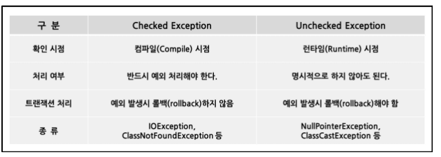

= Reading 6 : Exceptions
Reference by <http://web.mit.edu/6.005/www/fa15/classes/06-specifications/exceptions/>
v2.0, 2023-10-04
v1.0, 2023-09-23

* method's signature(이름, parameter types, return type)은 해당 메서드의 specification의 핵심 부분이며 signature에는 메서드가 발생시킬 수 있는 예외도 포함될 수 있습니다.

== Exceptions for signaling bugs

예외처리란?::
* 예외 처리는 프로그램 실행 중에 예기치 않은 상황 또는 오류가 발생했을 때 그것을 처리하는 메커니즘

exceptions for signaling bugs::
* 자바 프로그래밍에선 버그를 처리하는 예외가 있다. 이러한 예외는 주로 코드에 버그가 있을 때 발생 합니다.
* 예를 들어 ArrayIndexOutOfBoundsException은 배열 인덱스가 유효 범위를 벗어날 때 발생하며, NullPointerException은 null 객체 참조로 메서드를 호출하려고 할 때 발생합니다.

주로 예외 종류::
* ArrayIndex­OutOfBounds­Exception: 배열 인덱스 오류
* Null­Pointer­Exception: null 객체 참조 오류
* ArithmeticException: 산술 연산 오류 (e.g., 0으로 나누기)
* NumberFormatException: 정수로 파싱할 수 없는 문자열을 파싱하려고 할 때 발생

== Exceptions for special results

특별한 결과 처리::
* 프로시저가 특별한 결과를 반환해야 할 때 흔히 사용하는 방법은 특별한 값(예: -1 또는 null)을 반환하는 것 입니다. 그러나 이 방법에는 두 가지 문제가 있습니다.
. 반환 값을 확인하고 처리하는 것이 번거롭습니다.
. 반환 값을 확인하는 것을 잊어버리는 실수를 할 수 있습니다.

[source, java]
----
class BirthdayBook {
    LocalDate lookup(String name) { ... }
}
----

.이 메서드는 주어진 이름에 대한 생일 정보가 없는 경우 어떻게 처리할까?
* 이럴때 특별한 값 반환
* 예를 들어 9/9/99와 같은 특별한 날짜를 반환 가능했다.(이 날짜는 1960년대에 작성된 프로그램이 세기가 끝날 때 까지 실행되지 않을것으로 확실하다 생각함. 하지만 틀림)

예외를 활용한 해결. 다음과 같다
[source, java]
----
LocalDate lookup(String name) throws NotFoundException {
        ...
        if ( ...not found... )
            throw new NotFoundException();
        ...
}

    BirthdayBook birthdays = ...
    try {
        LocalDate birthdate = birthdays.lookup("Alyssa");
        // we know Alyssa's birthday
    } catch (NotFoundException nfe) {
        // her birthday was not in the birthday book
    }

----

* 이제 특별한 값을 사용할 필요가 없으며, 예외 처리를 통한 오류를 처리하고 결과 확인 가능하다.

== Checked and unchecked exceptions

image::image/minseo9974/i1.png[]

.**``Checked Exception:``**
** 컴파일러에 의해 강제 검사된다. 따라서 해당 예외가 발생할 수 있는 메서드는 예외를 throw하거나 try-catch해야 한다.
** 주로 프로그램의 흐름에서 예측 가능하고 복구 가능한 예외 상황
** checked exception은 예외적인 상황이지만 프로그램이 계속 실행될 수 있는 상황을 나타내며, 코드에서 명시적으로 처리해야한다.

.**``Unchecked Exception:``**
** 컴파일러에 의해 강제 검사되지 않는다. 따라서 메서드에서 이러한 예외를 throw 또는 try-catch하지 않아도 된다.
** 주로 프로그램의 버그 또는 실행 중에 복구할 수 없는 예외 상황을 나타냅니다.
** Unchecked exception은 프로그램이 더 이상 안정적으로 실행될 수 없는 상황을 나타내며, 일반적으로 예외가 발생하면 프로그램이 중지됩니다.

왜 checked exception과 unchecked exception을 구분하는가?::
* checked exception은 예상한 상황에서 발생할 것으로 예상되는 예외를 처리하기 위해 사용됩니다. 따라서 이러한 예외는 코드에서 명시적으로 처리되어야 합니다.

* 반면 unchecked exception은 주로 프로그램 버그를 나타내기 위해 사용됩니다. 이러한 예외는 코드의 상위 수준에서 처리됩니다.

예외 메시지::
* 모든 예외는 연관된 메시지를 가질수 있으며, 이 메시지는 생성자에서 제공되지 않으면 null 참조가 됩니다.

== Throwable hierarchy
=== Java의 예외 클래스 계층 구조 및 예외 유형

image::image/minseo9974/throwable.png[300,300]

.``**Throwable:**``
* Throwable 클래스는 예외를 던지거나 잡을 수 있는 객체의 클래스
* Throwable 클래스는 예외가 발생한 지점의 stack trace 및 선택적으로 예외를 설명하는 문자열을 기록합니다.
* throw또는 catch문에서 사용되거나 메서드의 throws 절에서 선언된 모든 객체는 Throwable의 하위 클래스이어야 합니다.

.``**Error:**``
* Error클래스는 Java런타임 시스템에 의해 생성된 오류에 대한 예외 클래스입니다(예: StackOverflowError, OutOfMemoryError)
* 무엇인가 이유로 AssertionError도 Error를 확장하고 있지만, 이것은 사용자 코드의 버그를 나타내므로 주의해야함.
* Error는 복구할 수 없는 예외로 간주되며 일반적으로 catch되지 않습니다.

사용자 정의 예외 클래스::
* 사용자가 직접 예외 클래스를 정의할 때 ,RuntimeException의 하위 클래스로 만들어서 이를 unchecked exception으로 만들거나 exception의 하위 클래스로 만들어서 이를 checked exception으로 만들 수 있습니다.
* 보통은 Error나 Throwable을 하위 클래스로 만들지 않습니다. 이러한 클래스는 Java에서 예약된 예외 클래스입니다.

== Exception design considerations
=== Java 예외 설계 고려사항

예외 사용의 고려사항::
* Java에서 예외는 가벼운 것이 아닌데, 이는 예외의 처리 비용 외에도 메서드 설계 및 사용에 어려움을 초래합니다.
* 메서드가 새 예외를 던질 때는 그 예외에 대한 새로운 클래스를 생성해야 합니다.
* checked exception을 던질 가능성이 있는 메서드를 호출할 때는 try-catch문으로 래핑해야 합니다. (예외가 발생하지 않더라도)

더 세분화된 규칙::
* checked exception 사용하는 경우:
** 클라이언트가 예외가 발생하지 않도록 하는 데 편리하고 비용이 적게 드는 방법이 없을 때
* unchecked exception 사용해야 하는 경우:
** 예상치 못한 버그가 나타날 때
** 클라이언트가 예외가 발생하지 않도록 하는 코드를 주로 작성할 것으로 예상될 때

예외 설계 예시::
* Queue.pop(): 큐가 비어 있을 때 체크되지 않은 EmtpyQueueException을 던집니다. 클라이언트가 Queue.size()또는 Queue.isEmpty()와 같은 호출로 이 예외를 피하는 것이 합리적이기 때문입니다.
* Url.getWebPage(): 웹 페이지를 검색할 수 없을 때 체크된 IOEException을 던집니다. 클라이언트가 이것을 방지하기 어려우므로 예외를 처리할 필요가 있습니다.
* int integerSquareRoot(int x): x의 정수 제곱근이 없을 때 체크된 NotPerfectSquareException을 던집니다. 클라이언트가 이것을 방지하기 어렵기 때문입니다.

null 참조 사용::
* Java API에서 null 참조를 특별한 값으로 사용하는 이유 중 하나는 예외 사용에 따른 비용 때문입니다. 이러한 사용은 신중하게 설계되고 명시적으로 지정되어야 합니다.

== 예외의 남용

예외를 남용한 예시

[source, java]
----
try{
    int i = 0;
    while(true)
        a[i++].f();
} catch(ArrayIndexOutOfBoundsException e){ }
----

* 이 코드는 배열 a의 인덱스를 넘어가려고 할 때 ArrayIndexOutOfBoundsException 예외를 던지고 그 예외를 잡아서 무시하는 무한 루프를 나타냅니다.

예외 남용의 문제점::
* 이 코드의 목적을 파악하기 어렵고 혼란스럽습니다.
* 예외 처리를 사용하여 루프를 제어하는 것은 효율적인 방법이 아닙니다. JVM은 예외 처리를 예외적인 상황에서만 사용할 수 있도록 설계되어 있으며, 성능 최적화를 위해 사용하지 않습니다.
* 일반적인 루프 종료 조건이 예외처리 남용 코드보다 70배는 빠릅니다.

버그 처리 문제::
* 더 나쁜 점은 예외를 남용한 방식은 버그 처리에 문제가 있습니다. 만약 코드 내부에서 f() 메서드 호출 시에 다른 배열에 접근하는 코드가 있다면, 이 코드에서도 ArrayIndexOutOfBoundsException 예외가 발생할 수 있습니다.
* 일반적인 루프를 사용한 경우에는 버그가 발생하면 예외가 발생하고 스레드가 종료됩니다. 그러나 "잘못된 예외 기반 루프"를 사용하면 예외가 버그 상황에서 발생하지만 그 예외가 단순한 루프 종료로 오해될 수 있습니다.

올바른 루프 사용::

[source, java]
----
for (int i = 0; i < a.length; i++) {
    a[i].f();
}

T타입 사용하는 경우

for (T x : a) {
    x.f();
}
----

결론::
* 예외 처리는 예외적인 상황에서만 사용해야 합니다. 루프 종료와 같은 정상적인 제어 흐름을 구현하기 위해 예외를 남용하는 것은 좋지 않습니다.
* 버그 처리에도 예외를 사용하는 것은 위험하며, 코드의 가독성과 성능을 저하시킬 수 있습니다.