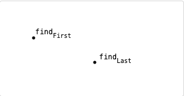
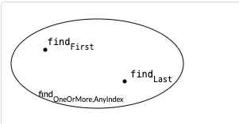
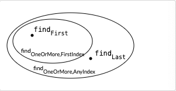

= Reading 7 : Designing Specifications
Reference by <http://web.mit.edu/6.005/www/fa15/classes/07-designing-specs/>
v2.0, 2023-10-04
v1.0, 2023-09-24

== objectives
* 부정확한 sepc을 이해, 불확실성을 식별하고 평가
* declaractive spec과 operational spec의 차이를 이해하고 declarative spec을 작성할수있다.
* precondition, postcondition그리고 spec의 strength를 이해하고 spec strength를 비교할 수 있다.
* 일관되고 유용한 규격을 작성하는 능력을 갖춘다.

== Introduction
.다양한 specification을 비교하고 그들 사이의 tradeoff(타협점)에 대해 살펴볼 것입니다.
* what is ``tradeoff``? 어떤 상황에서 한가지 요소를 향상 시키는 대신 다른 요소를 희생한다는 개념

.How deterministic(결정적)?
* 이것은 명세가 얼마나 "``일관적``"인지를 나타냄
* ``특정한 입력``에 대해 ``항상 동일한 출력``이 나온다. 즉, 같은 입력이 주어지면 항상 같은 결과가 나온다.

.How declarative(선언적)?
* 이것은 명세가 결과물이 "``무엇``"인지를 얼마나 자세하게 설명하는지를 나타냄
* 결과물이 어떤 특성을 가져야 하는지에 대한 설명은 제공하지만, ``실제 구현 방법에 대해서는 명세하지 않습니다``.
** 즉 "무엇"을 달성해야 하는지만 알려줍니다.

.How strong(강력한 정도)?
* 이것은 명세가 허용되는 구현의 "``다양성``"을 나타냄
* 강력한 명세는 ``특정한 방법``으로 ``구현``해야 하며 구현의 ``다양성``이 제한되어 있습니다.
** 이것은 구현자에게 ``더 제한적인 규칙``을 부과함.
* 약한 명세는 다양한 방법으로 구현할 수 있는 유연성을 허용합니다.
** 구현자가 여러 가지 방법 중 하나를 선택할 수 있다.

== Deterministic vs underdetermined specs
=== 결정적인 명세 vs 결정되지 않은 명세

[source, java]
----
// First
static int find(int[] arr, int val) {
    for (int i = 0; i < arr.length; i++) {
        if (arr[i] == val) return i;
    }
    return arr.length;
}

// Last
static int find(int[] arr, int val) {
    for (int i = arr.length - 1 ; i >= 0; i--) {
        if (arr[i] == val) return i;
    }
    return -1;
}
----

* 다음은 find에 대한 하나의 specification

[source, java]
----
static int findExactlyOne(int[] arr, int val)
  requires: val occurs exactly once in arr
  effects:  returns index i such that arr[i] = val
----

.Deterministic spec(결정적인 명세)
* "``val``이 배열 arr에서 정확히 한번 나타난다"는 명세

* 즉, 같은 입력이 주어지면 항상 같은 결과가 나옵니다.

다음은 약간 다른 명세입니다.

[source, java]
----
static int findOneOrMore,AnyIndex(int[] arr, int val)
  requires: val occurs in arr
  effects:  returns index i such that arr[i] = val
----

.underdetermined spec(결정되지 않은 명세)
* "``val``이 배열 arr에 나타난다"는 명세
* 즉, 같은 입력에 대해 여러 가지 다른 결과가 가능하다는 것을 의미

.``underdetermined``:
* 구현자가 여러가지 가능한 출력중 하나를 선택할수 있는 sepcification을 의미한다.
* 즉 ``underdetermined``명세는 구현자가 선택할 수 있는 여러가지 방법을 허용한다.

``underdetermined``과 ``nondeterministic(비결정론적)``의미의 차이는?

== Declarative vs operational specs
=== 선언적 명세 vs 운영 명세

.**operational specifications**(운영적 명세): 
* 메서드가 수행하는 단계별 절차를 설명합니다. 일종의 ``pseudocode``(의사 코드)설명이 이 operational specification에 해당합니다.
** 즉, 구체적인 구현 단계를 제공합니다.
** what is``pseudocode(의사 코드)``? 특정 프로그래밍 언어의 문법에 따라 쓰인 것이 아니라 일반적인 언어로 코드를 흉내 내어 알고리즘을 써놓은 코드

.**declarative specifications**(선언적 명세):
* 중간 단계의 세부 내용을 제공하지 않으며, 최종 결과물의 속성과 초기 상태와의 관계만을 제공합니다.

* 보통 **declarative specifications**를 선호합니다. 더 짧고 이해하기 쉬우며, 클라이언트가 구현 세부 사항에 의존하지 않도록 하므로 구현이 변경될 때 문제가 발생할 가능성이 줄어듭니다.

** 예를들어 find메서드의 두가지 구현을 모두 허용할때 명세는 메서드가 "val을 찾을 때까지 배열이 내려간다"는 명세 대신에 **``어떤 결과가 반환되어야 하는지 명시하는 것이 더 좋다``**. 그렇게 하면 클라이언트가 구현 세부 사항에 의존하지 않게 되어서 구현이 변경되어도 문제가 발생하지 않습니다.

.Don't do this
* 프로그래머가 때로는 명세 주석을 유지보수자에게 구현을 설명하는데 사용하기 때문에 운영 명세로 빠지는 경우가 있다 
* 이러한 설명은 메서드 내부의 주석을 이용하자

declarative specification를 다양하게 표현할수있다 다음과 같다

[source, java]
----
static boolean startsWith(String str, String prefix)
 effects: returns true if and only if there exists String suffix
            such that prefix + suffix == str

static boolean startsWith(String str, String prefix)
 effects: returns true if and only if there exists integer i
            such that str.substring(0, i) == prefix

static boolean startsWith(String str, String prefix)
 effects: returns true if the first prefix.length() characters of str
            are the characters of prefix, false otherwise
----

* 각 문자열 'str'이 주어진 문자열 'prefix'로 시작하는지 여부를 설명하는데, 어떤 방식으로 이루어지는지에 대한 구현 세부 사항은 명세에 나와있지 않습니다.

== Stronger vs Weaker specs

.새로운 s2명세가 현재s1명세보다 강하다는것은 다음과 같다.
* s2의 precondition < = s1의 precondition(약하거나 같다)
* s2의 postcondition >= s1의 postcondition(s1의 precondition 조건을 만족하는 상태에서)

* 만약 이러한 조건을 만족한다면, s1을 s2로 안전하게 대체 가능합니다.

.precondition을 **"약화할 수 있다"**
* 클라이언트에게 더 적은 요구사항을 제공하는 것은 절대로 문제가 되지 않습니다.

.postcondition을 **"강화할 수 있다"**
* 더 많은 약속을 하는 것을 의미합니다.
* 즉 이러한 규칙은 메서드의 명세를 더 관대하거나 더 엄격하게 만들 수 있습니다.

예를들어 다음과 같은 find 메서드의 명세:

[source, java]
----
static int findExactlyOne(int[] a, int val)
  requires: 정확히 한 번만 발생하는 경우
  effects:   a 배열에서 a[i] = val을 만족하는 인덱스 i를 반환합니다.

더 약한 precondition을 가진 명세로 대체 가능

static int findOneOrMore,AnyIndex(int[] a, int val)
  requires:  적어도 한 번 발생하는 경우
  effects:   a 배열에서 a[i] = val을 만족하는 인덱스 i를 반환합니다.

더 강한 postcondition 명세로 대체 가능

static int findOneOrMore,FirstIndex(int[] a, int val)
  requires:  적어도 한 번 발생하는 경우
  effects:  a 배열에서 a[i] = val을 만족하는 가장 낮은 인덱스 i를 반환합니다.

이런 종류의 명세를 다루는데 있어서 더 생각해볼 만한 명세도 있다.

6단원 맨마지막 예외의 남용 : 에러 처리에도 예외를 사용하는 것은 위험하며, 코드의 가독성과 성능을 저하시킬 수 있습니다.
예외를 남용하지 않고 특별한 값을 사용해 잘 처리한 예시?
static int findCanBeMissing(int[] a, int val)
  requires: nothing
  effects:  returns index i such that a[i] = val,
              or -1 if no such i
----

* 즉 명세 간의 강도를 비교하여 더 강한 명세로 대체할 수 있는지 여부를 결정하는 규칙에 대한 설명이다.

== Diagramming specifications
=== "자바 메서드의 가능한 모든 구현을 나타내는 공간을 상상해보자"
* ``findFirst``와 ``findLast``를 다이어그램화 합니다. 다시 코드를 확인하면 두 메서드는 spec이 아닌 메서드 구현입니다. 그래서 다이어그램에서 "점" 으로 나타냅니다.

* 그 다음 명세는 가능한 모든 구현 공간에서 일부 영역을 정의
** precondition이 postcondition을 만족하거나(영역 내에 있다), 만족하지 않을 수 있다(영역 외부에 있다)
* 예를 들어, findFirst와 findLast는 모두 findOneOrMore,AnyIndex 명세를 만족시키므로 해당 명세에 의해 정의된 영역 내에 위치합니다.

* 명세는 클라이언트와 구현자 간의 방화벽 역할을 합니다.
* 구현자는 명세 내에서 자유롭게 행동하며, 코드 개선, 명확성을 높이고, 버그를 수정할 수 있어야 합니다.
* 클라이언트는 어떤 구현을 받을지 모르며, 명세를 따라야 하지만 구현 방식을 변경할 자유가 있으며 구현이 갑자기 작동하지 않을까 걱정하지 않아도 됩니다.

* 비슷한 명세 간의 관계는 어떻게 될까요?(s1명세에서 시작해 새로운 s2명세를 생성 했을 경우)

* s2가 s1보다 강하다면 우리 다이어그램엔 어떻게 나타날까?

* **``strengthening the postcondition.``**: s2의 postcondition이 s1의 postcondtioin보다 더 강한 경우는 s2가 더 강한 명세이다.

* 이전에 findOneOrMore,AnyIndex를 만족시켰더라도 이제 명세가 가장 낮은 인덱스 i를 요구하기 때문에 어떤 인덱스 i를 반환하던 상관 없었을 수 있습니다. 따라서 이제는 findOneOrMore,AnyIndex 내에 있지만 findOneOrMore,FirstIndex 밖에 있는 구현이 있습니다.

* 더 약한 명세는 더 큰 영역을 정의한다.

* **``weaken the precondition``**: s2가 s1보다 더 강한 명세가 됩니다.
** 더 적은 요구사항을 표현하며, 구현자는 이전에는 제외되었던 새로운 입력을 처리해야하며, 알아 차리지 못하고 통과한 입력중 잘못 처리된게 여기서 걸러진다.

== 좋은 명세의 설계(Designing good specifications)

* 명세의 형태에 대해서는 명백하고 간결하며 잘 구조화되어 있어야 하고 읽기 쉬워야 한다.

* 명세의 내용이 어려울때 유용한 지침 몇가지가 있다

=== 1. 일관된 specification

[source, java]
----
static int sumFind(int[] a, int[] b, int val)
  effects: 배열 a와 b에서 val이 나타나는 모든 인덱스의 합을 반환합니다.
----
.Avoid Multiple cases:
* 명세서는 일관성이 없는 여러 case를 포함해서는 안된다

* 인덱스를 찾는 메서드와 그 인덱스 값을 합산하는 메서드 이렇게 두 개의 별도의 프로시저로 분리하는 것이 좋습니다.

[source, java]
----
public static int LONG_WORD_LENGTH = 5;
public static String longestWord;

/**
 * longestWord를 words의 가장 긴 요소로 업데이트하고
 * 콘솔에 LONG_WORD_LENGTH보다 길이가 큰 요소의 수를 출력합니다.
 * @param words 긴 단어를 검색할 목록
 */
public static void countLongWords(List<String> words)
----
* 전역 변수 사용과 void를 사용한 print 사용 외에도

.Separate Responsibilities(책임 분리):
* sepcification이 메서드의 일관된 역할에 집중하도록 보장
* 예: `countLongWords` 메서드를 단어 수를 세는 것과 가장 긴 단어를 찾는 것, 이를 두 개의 메서드로 분리하면 명확성과 재사용성이 향상됩니다.

=== 2. The results of a call should be informative
유용한 결과값::

[source, java]
----
/**
 * (key, val)을 매핑에 삽입하고, 기존 키에 대한 매핑을 덮어쓰며,
 * 키에 대한 이전 값(있을 경우)을 반환합니다. 이전 값이 없는 경우 null을 반환합니다.
 * @param map 매핑에 삽입할 맵
 * @param key 키
 * @param val 값
 * @return 키에 대한 이전 값(있을 경우) 또는 null(없을 경우)
 */
static V put (Map<K,V> map, K key, V val)
----

.반환 값은 유용해야 합니다
* 메서드가 키에 대한 값이 없을 경우 특별한 값으로 null값을 허용한다면 만약 메서드가 null을 반환하면 키가 이전에 바인딩되지 않았는지 아니면 null로 바인딩되었는지를 알 수 없게 됩니다.

* 즉, 이러한 명세는 사용하기 어려우며, 결과가 명확하지 않을수 있다.

=== 3.The specification should be strong enough
충분히 강한 명세서::

.메서드 명세가 충분히 강해야 한다.
* 이 스펙은 특별한 경우를 처리하는 데 부적절하게 작성된 스펙입니다. 특별한 경우가 메소드의 유용성을 무너뜨리지 않도록 주의를 기울여야 합니다.

* 예를 들어, 잘못된 인수에 대한 검사를 위해 체크된 예외를 throw하는 것은 의미가 없습니다. 왜냐하면 이러한 경우에 임의의 변경이 허용되면 클라이언트는 실제로 어떤 변경이 이루어졌는지 확인할 수 없기 때문입니다. 

[source, java]
----
/**
 * list2의 요소를 list1에 추가합니다.
 * 단, null 요소를 만나면 NullPointerException을 throw합니다.
 * @param list1 요소를 추가할 첫 번째 리스트
 * @param list2 요소를 가져올 두 번째 리스트
 * @throws NullPointerException null 요소를 만나면 발생
 */
static void addAll(List<T> list1, List<T> list2)
----

* NullPointerException이 발생하면 클라이언트는 list2의 어떤 요소가 실제로 list1로 이동했는지 스스로 판단해야 합니다.

=== The specification should also be weak enough
충분히 약한 명세서::

[source, java]
----
static File open(String filename)
  effects: opens a file named filename
----

.과도한 약속을 하지 않습니다

* 메서드가 실제로 실현할수 없는 보장을 제공하는 과도하게 강력한 명세를 피해야 합니다.
** 예: 파일을 열기 위한 메서드 명세는 파일이 항상 성공적으로 열릴 것을 보장해서는 안됩니다. 대신, 메서드가 파일을 열도록 시도하고 성공하면 파일이 특정 속성을 가질 것임을 설명해야합니다.

=== specification은 가능하다면 abstract types을 사용한다.
추상 타입 사용::

.추상 타입 활용:
* 가능한 경우 구체적인 구현 타입이 아닌 추상 타입(예: 인터페이스)을 명세서에 사용하여 클라이언트와 구현자에게 더 많은 유연성을 제공합니다.
** 예: ``ArrayList``를 반환하는 대신 더 추상적인 ``List``를 명세에 사용하세요. 이렇게 하면 다양한 구현을 사용하더라도 동일한 동작을 보장합니다.

[source, java]
----
static ArrayList<T> reverse(ArrayList<T> list)
  effects: returns a new list which is the reversal of list, i.e.
             newList[i] == list[n-i-1]
             for all 0 <= i < n, where n = list.size()
----

* 명세는 클라이언트와 구현자가 ArrayList를 사용하도록 강제한다. ArrayList에 대한 구체적인 의존성이 없는 명세의 경우 더 추상적인 List를 기반으로 이 명세를 작성하는 것이 더 좋습니다.

=== Precondition or Postcondition?

precondition의 고려사항::
* precondition을 사용할 때는 클라이언트가 메서드를 호출하기 전에 조건을 검사하고 맞춰야 하므로 조금 불편할 수 있습니다.
* Java API와 같이 대부분의 라이브러리는 잘못된 인수를 전달할 때 예외를 throw하는 것을 선호
* precondition을 사용할 때는 성능 문제도 고려해야한다. 성능이 중요한 경우 precondition보다 fast fail이 나을 수 있기 때문입니다.

메서드의 범위에 따른 판단::
* 만약 메서드가 클래스 내에서만 사용되고 클라이언트에 의해 직접 호출되지 않는 경우 precondition 사용이 적합할 수 있으나, 메서드가 public이며 다른 부분에서 사용되는 경우, 예외를 throw하는것이 더 현명한 선택입니다.

== About access control

. ``**공개 메서드(public methods)**``
** 프로그램의 다른 부분에서 자유롭게 access할 수 있으며, 이는 해당 클래스가 제공하려는 서비스로서 메서드를 공개 한다는 것을 의미
** 모든 메서드를 public으로 만들면 클래스 내부에서만 사용하려고 했던 ``helper method``와 같은 메서드도 다른 부분에 의존할 수 있다.

. ``**비공개 메서드(private methods)**``
** 클래스의 public 인터페이스가 더 간결해지며, 코드를 이해하기 쉬워짐.
** 내부 상태를 보호 하는 것은 프로그램을 버그로부터 안전하게 유지하는데 도움이 된다.

== About static vs instance methods

* Static method는 Class method라고도 불린다.
클래스 내부에 정의하지만, 인스턴스에는 속하지 않는다는 특징이 있다.

.가장 큰 차이점은 객체 생성 여부

* Static method는 클래스 변수와 마찬가지로
객체를 생성하지 않고 클래스명.메서드명으로 호출 가능하다.

* Instance method는 Static method와는 달리, 반드시 객체를 생성한 후에 호출 가능하다.
즉, Instance method는 인스턴스가 반드시 존재해야만 사용할 수 있다.

[source, java]
----
static일때

static int find(int[] arr, int val)
  requires: val occurs in arr
  effects:  returns index i such that arr[i] = val

배열과 값을 입력으로 받아 배열에서 값을 찾아 인덱스를 반환합니다.

int find(int val)
  requires: val occurs in *this array*
  effects:  returns index i such that *the value at index i in this array*
              is val
IntArray 클래스에서 호출되며, 해당 클래스의 배열에서 값을 찾아서 인덱스를 반환합니다.
----
ex) this.val += val;

== 정리

* 선언적 명세서(declarative specifications)가 실제로 가장 유용합니다. 이러한 명세서는 코드를 읽지 않고도 클라이언트가 모듈을 사용할 수 있게 합니다.

* 사전조건(preconditions)은 명세를 약화시키지만, 적절하게 적용하면 소프트웨어 디자이너에게 필수적인 도구입니다. 구현자는 필요한 가정을 할 수 있도록 해줍니다.

. Safe from bugs
.. 명세가 없으면 프로그램의 아주 작은 변경이 전체 프로그램을 무너뜨릴수 있다.
. Easy to understand
.. 잘 작성된 선언적 명세는 클라이언트가 코드를 읽거나 이해하지 않아도 됩니다.
. Ready for change
.. 적절하게 약한 명세는 구현자에게 자유를 주고, 적절하게 강한 명세는 클라이언트 에게 자유를 줍니다. 심지어 명세 자체를 변경하게 더욱 강하게 할수 있으므로 사용되는 모든곳을 검토할 필요가 없습니다.(precondition 및 postcondition 강화)