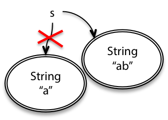

# Reading 9: Mutability & Immutability

# 목적

- Mutability와 Mutable Object에 대한 이해
- `aliasing` 의 식별과 mutability의 위험성에 대한 이해
- 정확성, 명확성, 변경 가능성을 향상시키기 위한 immutability의 사용

# Mutability

`String` 은 Immutable type의 예시이다.

`String` Object는 항상 동일한 문자열을 표현한다

`StringBuilder` 는 mutable type의 한 예시이며, 이는 문자열의 일부를 삭제하거나 문자를 삽입 혹은 대체하는 메서드를 가지고 있다

`String` 은 immutable하기 때문에, 한번 생성되면 `String` object는 항상 같은 값을 가진다

`String` 의 끝에 무언가를 추가하려고 하면, 반드시 새로운 String object를 만들어야 한다

```java
String s = "a";
s = s.concat("b"); // s+="b" and s=s+"b" also mean the same thing
```



대조적으로, `StringBuilder` object는 mutable하다

클래스에 새로운 값만 반환하는 것이 아니라 object의 값을 변경시키는 메서드를 가지고 있다.

`StringBuilder` 는 문자열의 일부를 삭제하거나, 중간에 삽입하거나, 개별 문자를 변경하는 메서드도 있다

```java
StringBuilder sb = new StringBuilder("a");
sb.append("b");
```


이러한 두 경우 모두, 결국 `s` 와 `sb` 는 문자열 `"ab"` 를 가리키게 된다

mutability와 immutability 사이의 차이점은 object가 오직 하나의 reference를 가지는 경우에는 크게 중요하지 않는다

하지만, Object에 대한 다른 reference가 있을 때 그 둘의 행동에는 큰 차이가 있다

예를 들어, 또다른 변수 `t` 가 `s` 와 동일한 String 객체를 가리키고, 또 다른 변수 `tb` 가 `sb` 와 같은 `StringBuilder` 를 가리킨다고 할 때

immutable과 mutable object의 차이는 더욱 분명해진다

```java
String t = s;
t = t + "c";

StringBuilder tb = sb;
tb.append("c");
```

- 불변 객체(String):
  - s와 t가 동일한 "ab" 문자열을 가리키는 경우, 하나의 문자열 객체가 메모리에 있습니다. 이 객체는 변경할 수 없으므로 (불변성), s와 t가 이를 공유해도 안전합니다. 다른 참조자들이 이 객체를 수정할 수 없습니다.
- 가변 객체(StringBuilder):
  - sb와 tb가 동일한 StringBuilder를 가리키는 경우, 둘 다 동일한 가변 객체를 공유합니다. 가변 객체는 내용을 변경할 수 있으므로(sb에 문자열을 추가하거나 변경하는 등) sb의 변경은 tb에도 영향을 미칩니다. 이로 인해 예상치 못한 부작용이 발생할 수 있습니다.

즉, 불변 객체인 String은 참조를 공유해도 안전하고, 다른 참조자에게 영향을 주지 않습니다.

반면에 가변 객체인 StringBuilder는 참조를 공유할 때 예기치 않은 동작을 일으킬 수 있으므로 주의가 필요합니다.

이러한 차이로 인해 불변 객체는 다중 스레드 환경에서 더 안전하며, 예측 가능한 코드를 작성하기가 더 쉬울 수 있습니다.


왜 우리는 mutable한 `StringBuilder` 가 프로그래밍에 필요할까?

```java
String s = "";
for (int i = 0; i < n; ++i) {
    s = s + n;
}
```

Immutable 문자열을 사용하는 것은 많은 Temporary copies를 발생시킨다

- 문자열 `s+n` 최종 문자열을 구성하는 과정에서 `n` 번 복사될 것이다
- 두번째 `s+n+n` 은 `n-1` 번 복사될 것이다
- 세번째 `s+n+n+n` 은 `n-2` 번 복사될 것이다
- `n`번째 `s+n+n+n+n` 은 `1` 번 복사될 것이다

결과적으로, n개의 element를 concatenate하는 연산은 `n + n-1 + n-2 + ... + 1` 번 복사되는 상황이 발생하여 결국 `O(n^2)` 의 시간 복잡도를 가지게 된다

```java
StringBuilder sb = new StringBuilder();
for (int i = 0; i < n; ++i) {
  sb.append(String.valueOf(n));
}
String s = sb.toString();
```

좋은 성능을 내는 것은 왜 우리가 Mutable object를 사용해야 하는 이유이다

다른것은 convenient sharing이다

이는 프로그램의 두 부분이 공통적인 mutable data structure를 공유하는 경우 더 편리하게 communicate할 수 있게 해줌

# Risks of mutation

Mutable type은 Immutable type에 비해 훨씬 더 강력해 보인다

하지만 항상 그런것은 아니고, Immutable type은 버그에 안전하고 이해하기 쉬우며 ready-for-change하다는 장점이 있다

Mutability는 프로그램이 하는것을 이해하기 더 어렵게 만들고, contract를 시행하기 어렵게 만든다

## Risky example #1: passing mutable values

```java
/** @return the sum of the numbers in the list */
public static int sum(List<Integer> list) {
    int sum = 0;
    for (int x : list)
        sum += x;
    return sum;
}
```

위와 같이, 리스트의 요소를 모두 더한 값을 반환하는 `sum()` 메서드가 있다

```java
/** @return the sum of the absolute values of the numbers in the list */
public static int sumAbsolute(List<Integer> list) {
    // let's reuse sum(), because DRY, so first we take absolute values
    for (int i = 0; i < list.size(); ++i)
        list.set(i, Math.abs(list.get(i)));
    return sum(list);
}
```

리스트의 모든 요소의 절댓값을 모두 더한 값을 반환하는 `sumAbsolute()` 메서드가 있다

알아야 하는 점은, 이 메서드는 리스트를 직접 변화시키는 방법으로 작업을 수행한다

이것은 존재하는 리스트를 재사용하여 효율적이기 때문에 현명한 구현으로 보인다

만약 리스트에 수백만의 항목이 존재하고, 절대값이 새로운 수백만의 항목을 생성하는 데에 드는 시간과 메모리를 절약할 수 있다

DRY와 성능 측면에서 좋은 설계라고 할 수 있을 것이다

```java
// meanwhile, somewhere else in the code...
public static void main(String[] args) {
    // ...
    List<Integer> myData = Arrays.asList(-5, -3, -2);
    System.out.println(sumAbsolute(myData));
    System.out.println(sum(myData));
}
```

`sumAbsolute(myData)` 의 동작으로 인하여 `mydata` 배열의 요소 전체를 절대값으로 바꿔버리기 때문에

`sum(myData)` 는 기존 `myData` 의 요소가 아닌, 절대값의 총 합이 나오게 된다

### Safe From bugs?

- 이 예제에서, `sumAbsolute()` 는 spec에서 요구하는 것 이상으로 작동하게 된다
- mutable object를 통과시키는 것은 잠재적인 버그이다
- 단지 어떤 프로그래머가 의도치 않게 변형시키기를 기다리고 있을 뿐이다
- 종종, 재사용이나 성능 측면과 같이 매우 좋은 의도를 가지고 있지만, 결과적으로 추적하기 매우 어려울 수 있는 버그가 발생한다

### Easy to understand?

- `main()` 을 읽을 때, `sum()` 과 `sum-Absolute()` 가 `myData` 의 값을 변경할 것이라는 것이 명백하게 보여지지 않는다

# Risky example #2: returning mutable values

우리는 mutable object를 function에 전달할 때 발생하는 문제에 대하여 보았다

만약 mutable object를 return하는 것은 어떨까?

```java
/** @return the first day of spring this year */
public static Date startOfSpring() {
    if (groundhogAnswer == null) groundhogAnswer = askGroundhog();
    return groundhogAnswer;
}
private static Date groundhogAnswer = null;
```

```java
// somewhere else in the code...
public static void partyPlanning() {
    // let's have a party one month after spring starts!
    Date partyDate = startOfSpring();
    partyDate.setMonth(partyDate.getMonth() + 1);
    // ... uh-oh. what just happened?
}
```

- `startOfSpring()` 은 `groundhogAnswer` global variable에 `askGroundhog()` 의 return value를 저장한다
- 또한, 이를 returning한다
- `partyPlanning()` 은 봄이 시작되고 한달 후에 시작하기 위하여, `partyDate` 에 `startOfSpring()` 으로부터 받은 `Date` 객체를 바탕으로, 1을 더한 값을 저장한다

- 하지만 여기서 문제점은, `startOfSpring()` 의 `groundhogAnswer` 과 `partyPlanning()` 메서드의 `partyDate` 는 같은 Object를 참조하고 있다
- 따라서 `partyPlanning()` 메서드에서, `partyDate.setMonth(partyDate.getMonth() + 1)` 은 `partyDate` 의 Month를 1 증가시키는것 뿐만 아니라, 같은 Object를 reference 하고있는 `groundhogAnswer` 에도 1이 증가되는 (같은 Object이기 때문) 영향을 준다

### 해결책

```java
return new Date(groundhogAnswer.getTime());
```

- _defensive copying_ 을 통하여 위 문제를 해결할 수 있다
- 하지만, 이를 immutable type을 사용했다면 동일한 값을 안전하게 공유할 수 있기 때문에 더 적은 복사와 더 적은 메모리 공간으로 가능했을 것이다

# Aliasing is what makes mutable types risky

실제로 Mutable object를 사용하는 것은 Object에 대한 참조가 하나뿐인 메서드 내에서 Local로 사용하는 경우에는 괜찮다

문제가 되는 것은, 동일한 Mutable object에 대한 Alias라고 불리는 여러 개의 참조를 갖는 것이다

# Specifications for mutating method

이 시점에서, 메서드가 Mutation을 수행할 때 Muation을 Spec에 포함시키는 것이 중요하다는 것을 분명히 해야한다

Mutating Method의 예시

```
static void sort(List<String> lst)
requires: nothing
effects:  puts lst in sorted order, i.e. lst[i] <= lst[j]
              for all 0 <= i < j < lst.size()
```

Mutate하지 않는 예시

```
static List<String> toLowerCase(List<String> lst)
requires: nothing
effects:  returns a new list t where t[i] = lst[i].toLowerCase()
```

- Specification에 Mutate될 수 있다고 명시적으로 말하지 않는 경우, 암묵적으로 입력의 Mutation이 허용되지 않는다고 가정한다

# Iterating over arrays and lists

우리가 다음으로 살펴볼 Mutable object는 `iterator` 이다

- 요소들의 집합을 단계적으로 통과하여 요소들을 하나씩 반환하는 객체이다
- `Java` 에서는 `List` 나 array를 순회할 때, For-loop에서 사용된다

```java
List<String> lst = ...;
for (String str : lst) {
    System.out.println(str);
}
```

위 코드는 아래 코드로 컴파일러에 의하여 다시 작성된다

```java
List<String> lst = ...;
Iterator iter = lst.iterator();
while (iter.hasNext()) {
		String str = iter.next();
    System.out.println(str);
}
```

iterator는 두가지 메서드가 존재한다

- `next()` 집합의 다음 요소를 리턴한다
- `hasNext()` iterator가 집합의 끝에 도달하였는지 아닌지를 체크한다

`next()` 는 요소를 리턴하는것 뿐 아니라 iterator를 전진시키는(다음 인덱스를 참조) mutator 메서드이다

따라서 다음 `next()` 호출은 다른 요소를 반환한다

# Mutation undermines an iterator

```java
public static void dropCourse6(ArrayList<String> subjects) {
    MyIterator iter = new MyIterator(subjects);
    while (iter.hasNext()) {
        String subject = iter.next();
        if (subject.startsWith("6.")) {
            subjects.remove(subject);
        }
    }
}
```

다음과 같은 코드에서

```bash
// dropCourse6(["6.045", "6.005", "6.813"])
//   expected [], actual ["6.005"]
```

위와 같은 오류가 발생하였음

```java
for (String subject : subjects) {
    if (subject.startsWith("6.")) {
        subjects.remove(subject);
    }
}
```

이는 `for` loop의 syntactic sugar인 `for-each` 에서 발생할 수 있는 `ConcurrentModificationException` 오류로

컬렉션을 반복하는 동안 컬렉션을 수정하는 것은 안전하지 않을 수 있음

수정할 요소를 따로 모아두고, 반복문이 종료된 후 수정하는 것이 바람직함

혹은 Iterator의 remove() 를 사용하는 것이 좋음

### 첫번째 해결책

```java
Iterator iter = subjects.iterator();
while (iter.hasNext()) {
    String subject = iter.next();
    if (subject.startsWith("6.")) {
				iter.remove(subject);
    }
}
```

다음과 같이 `Iterator` 의 `remove()` 를 사용하는 것은 이 문제를 ㅜ해결할 수 있는 하나의 방법이다

`iter.remove()` 를 하면, 제거해야 할 해당 요소가 어디에 있는지 이미 알고 있음. (`subjects.remove()` 를 하면 처음부터 다시 찾았어야 했음)

# Mutation and Contracts

## Mutable objects can make simple contracts very complex

Mutable data structure의 문제점 중 하나는 동일한 가변 객체에 대한 여러 참조(alias)가 있을 수 있으며, 프로그램의 여러 곳(멀리 떨어진 곳)에서 해당 객체가 일관되게 유지되기를 기대할 수가 있다는 것임

Specification의 관점에서 설명하면, 더이상 클래스의 Client와 Implementer 사이에 하나의 장소에서만 시행할 수 있는 계약이 아니다

Mutable Object를 사용한 계약은 이에 대한 참조를 갖는 모든 사람들의 좋은 행동에 달려있음(이를 수정하지 않아야 한다)

이처럼 ,Global properties에 대한 추론이 필요하면, Mutable data type을 가진 프로그램을 이해하고 정확성에 대한 신뢰를 갖는 것은 훨씬 어려워짐

성능과 편의성을 위해 그럴 필요가 있지만, 버그 안전성에 대한 큰 비용을 지불해야 함

요약하자면, 가변 객체와 관련된 주요 문제는 여러 곳에서 객체를 참조할 수 있다는 것이며, 이로 인해 프로그램의 계약이 더 이상 단일 지점에서 시행되지 않으며 모든 관련자의 협조를 필요로 한다는 점입니다. 이로 인해 가변 데이터 구조를 사용하는 프로그램의 이해도와 정확성이 떨어질 수 있지만, 성능과 편의성을 위해서는 가끔 이러한 구조를 사용해야 할 때가 있습니다.

## Mutable Objects reduce changeability

Mutable Object는 client와 implementer 사이의 계약을 더욱 복잡하게 만들고, 이들 사이의 변경에 대한 자유를 감소시킨다

다시 말해서, 변경이 허용된 Object가 코드를 변경하기 어렵게 만든다는 것임

```java
/**
 * @param username username of person to look up
 * @return the 9-digit MIT identifier for username.
 * @throws NoSuchUserException if nobody with username is in MIT's database
 */
public static char[] getMitId(String username) throws NoSuchUserException {
    // ... look up username in MIT's database and return the 9-digit ID
}
```

다음과 같이, `username` 을 입력하면 9자리의 `MitId` 를 반환해주는 메서드가 존재함

```java
char[] id = getMitId("bitdiddle");
System.out.println(id);
```

다음과 같이, `username` 으로부터 얻은 `id` 를 출력하는 메서드를 만들 수 있음

### client와 implementor 모두 개별적으로 다음과 같이 변경하였음

```java
char[] id = getMitId("bitdiddle");
for (int i = 0; i < 5; ++i) {
    id[i] = '*';
}
System.out.println(id);
```

client는 사용자의 개인정보에 대한 걱정으로, id의 앞 5글자를 마스킹 처리를 하도록 코드를 변경하였음

```java
private static Map<String, char[]> cache = new HashMap<String, char[]>();

public static char[] getMitId(String username) throws NoSuchUserException {
    // see if it's in the cache already
    if (cache.containsKey(username)) {
        return cache.get(username);
    }

    // ... look up username in MIT's database ...

    // store it in the cache for future lookups
    cache.put(username, id);
    return id;
}
```

implementer는 데이터베이스의 속도와 부하를 걱정하여, 캐시가 한번이라도 검색했던 username을 기억하도록 코드를 수정하였음

### 문제점

client와 implementer의 cache가 같은 char array를 가리키고 있음

→ array가 aliased되었다(둘 이상의 reference를 가짐)

결과적으로 나중에 `getMitId` 의 return은 `928432033` 과 같은 9자리 숫자가 아닌, obscured된 `*****2033` 가 리턴될 것이다

### Mutable object를 공유하는 것은 Contract를 복잡하게 만든다

contract의 실패로 인하여 책임을 따지려고 할때?

- Client가 `getMitId` 를 통해 return받은 Object를 수정하지 않아야 할 책임이 있는가?
- Implementer가 return받은 Object를 보관하지 않아야 할 책임이 있는가? (cache)

Specification을 명확히 할 수 있는 한가지 방법이 있음

```jsx
public static char[] getMitId(String username) throws NoSuchUserException
  requires: nothing
  effects: returns an array containing the 9-digit MIT identifier of username,
             or throws NoSuchUserException if nobody with username is in MIT’s
             database. Caller may never modify the returned array.
```

_Caller may never modify the returned array._

이처럼 Spec을 명확히 하여 이에 대한 책임을 분명히 설정하는 것

### 하지만, 이는 좋지 않은 방법임

이러한 접근법에 대한 문제점은 나머지 전체 프로그램에 대하여 contract가 유효해야 한다는 것임

우리가 작성해왔던 contract의 범위는 이보다 훨씬 좁았고, 단지 precondition과 postcondition을 생각하면 되었으며 나머지 시간동안 무슨일이 발생하는지는 상관하지 않아도 되었음

하지만 이 contract의 범위는 매우 넓다는 것이 문제임

이를 사용하는 연관된 모든 사용자가 이를 수정하면 안된다는 lifetime contract가 존재함

```jsx
public static char[] getMitId(String username) throws NoSuchUserException
  requires: nothing
  effects: returns a new array containing the 9-digit MIT identifier of username,
             or throws NoSuchUserException if nobody with username is in MIT’s
             database.
```

이처럼 새로운 array를 리턴한다면? 해당 문제는 해결할 수 있음

### 하지만 문제를 전적으로 해결할 수는 없음

implementer가 새로운 array에 대한 alias를 들고 있는 것을 방지할수 있는가?

더 나아가, 이를 사용하여 변경하거나 재사용하는 것을 막을 수 있는가?

```jsx
public static String getMitId(String username) throws NoSuchUserException
  requires: nothing
  effects: returns the 9-digit MIT identifier of username, or throws
             NoSuchUserException if nobody with username is in MIT’s database.
```

return type으로 immutable String을 사용하는 것은 char array를 사용할 때처럼, client와 implementer 사이를 침범하지 않는다는 보장(guarantee)를 제공함

또한 Spec comment를 주의 깊게 읽는 것에 의존하지 않으며, String은 Immutable이기 때문에 Implementer가 cache를 도입할 수 있는 자유를 제공함

# Useful immutable types

- primitive types, primitive wrappers → immutable
  - `BigInteger` `BigDecimal` → immutable
- `Date` → mutable
  - `java.time` → immutable
- `Collections types` : `List`, `Set`, `Map` … `ArrayList`, `HashMap`, …. → mutable
  - Unmodifiable views: `Collections.unmodifiableList` , `~.unmodifiableSet`, `~.unmodifiableMap`
  - mutation을 시도하면(`add`, `remove`, `put` , …) `UnsupportedOperationException` 이 발생함

```jsx
Before we pass a mutable collection to another part of our program, we can wrap it in an unmodifiable wrapper. We should be careful at that point to forget our reference to the mutable collection, lest we accidentally mutate it. (One way to do that is to let it go out of scope.) Just as a mutable object behind a final reference can be mutated, the mutable collection inside an unmodifiable wrapper can still be modified by someone with a reference to it, defeating the wrapper.

Collections also provides methods for obtaining immutable empty collections: Collections.emptyList, etc. Nothing’s worse than discovering your definitely very empty list is suddenly definitely not empty!
```

# Summary

Mutability는 성능, 편의성 측면에서 유용하지만 Global level에서 객체를 사용하는 코드가 잘 작동해야 하므로 버그 발생 가능성을 높일 수 있음

또한 Immutable Object(like `String`) 와 Immutable Reference(like `final`)의 차이에 대해 이해하고, 이러한 디자인 원칙을 사용하면 어떻게 주요 목표를 달성할 수 있는지에 대해 언급함

- Safe from bugs
  - Immutable Object는 Aliasing에 의한 버그에 민감하지 않음
  - Immutable Reference는 항상 동일한 Object를 가리킴
  - Object가 변하지 않으므로 예상치 못한 버그를 방지하는 데 도움이 됨
- Easy to understand
  - Immutable Object, Reference는 항상 동일한 의미를 가지므로, 코드를 읽는 사람이 이를 이해하는 데 더 간단함
  - Object나 Reference가 변경될 수 있는 모든 코드를 찾기 위해 코드를 추적할 필요가 없음
  - 코드를 이해하기 쉽게 만듦
- Ready for Change
  - Object나 Reference가 실행 중에 변경될 수 없다면, 해당 Object나 Reference에 의존하는 코드를 프로그램이 변경될 때 수정할 필요가 없음
  - Immutability는 코드의 유지 보수성을 향상시킴
