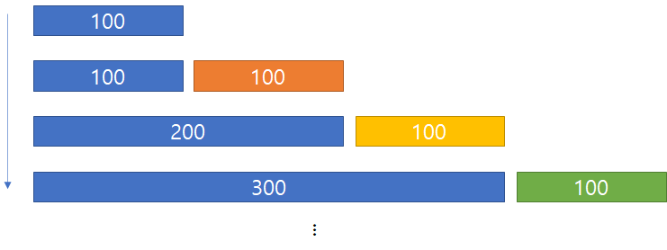

= Reading 9: Mutability & Immutability
Reference by <http://web.mit.edu/6.005/www/fa15/classes/09-immutability/>
v1.0, 2023-09-26

Objectives::
- mutability(가변성)와 mutable objects(가변 객체)에 대한 이해
- Aliasing을 식벽하고 mutability(가변성)의 위험성을 이해
- Immutability(불변성)을 활용해 정확성, 명확성 및 변경 가능성 향상

NOTE: **`Aliasing`**? 하나의 객체나 데이터에 대해 여러 개의 다른 변수나 참조가 있는 경우

== Mutability(가변성)

[horizontail]
immutable::
- 해당 객체 내용을 변경 불가
- example) ``String``(문자열)
- 한번 생성된 문자열 객체는 항상 동일한 문자열 가짐

[source, java]
----
String s = "a";
s = s.concat("b"); // s+="b" and s=s+"b" 의미 동일
----
- 내용을 변경 불가하기에 새로운 문자열 객체 재할당

[horizontail]
mutable::
- 객체의 값을 변경할 수 있는 메서드 가짐
- example) ``StringBuilder``
- 문자열 일부를 삭제하거나 문자를 삽입, 교체하는 메서드 가짐

[source, java]
----
StringBuilder sb = new StringBuilder("a");
sb.append("b");
----
- 문자열을 동적으로 수정함

[horizontail]
객체에 다른 참조(reference)가 있는 경우::

[source, java]
----
**mutable과 immutability 객체 간의 차이**

String t = s;
t = t + "c";

원래의 s객체는 변경되지 않는다.

StringBuilder tb = sb;
tb.append("c");

sb와tb 모두 "abc"를 나타내며, sb가 변경된다면 tb또한 같은 객체를 가리키고 있으므로 동시에 변경됨
----

[horizontail]
그렇다면 왜 mutable객체인 StringBuilder가 필요할까?::
- 많은 문자열을 하나로 연결해야 할때가 흔하다.

[source, java]
----
String s = "";
for (int i = 0; i < n; ++i) {
    s = s + i;
}
----
- 실제론 n개의 요소만 연결하는 작업이나 모든 복사본은 O(n^2) 시간 소요

[horizontail]
IMPORTANT: 어째서 시간 복잡도가 n^2이나 걸리는가

    - 처음 생각으론 n=3일 경우
----
s(0) = ""+3 +
s(1) = s(0)+3 +
s(2) = s(1)+3 +
----
    - 계속해서 새로운 문자열 객체를 할당하기에 시간 복잡도는 n번만 시행한다고 생각하였음

    - 그러나 실제론 array라고 생각하자 for문 안에서 for문이 한번도 돌고있는 것과 같다 배열이 길이만큼 i번째마다 복사를 시행

    - 그림으로 이해해보자

what about StringBuilder::
* 문자열 복사를 하지않고 직접 내부 데이터 구조에 추가
* ``toString()``메서드 호출시에만 복사 수행
[source, java]
----
StringBuilder sb = new StringBuilder();
for (int i = 0; i < n; ++i) {
  sb.append(String.valueOf(n));
}
String s = sb.toString();
----

* 미리 일정한 크기의 배열을 잡아두고 붙여나가는 방식

StringBuilder vs StringBuffer::
* 두개의 차이는 synchronized
* StringBuffer는 multi threads 환경에서 동시에 여러 쓰레드가 접근 가능하다

== Risk of mutation

.mutable type과 immutable type 둘중 하나를 고른다면?
* 정답은 ``immutable``type이 버그로부터 더 안전하고 이해하기 쉬우며, 변경하기 더 쉽습니다.

.그렇다면 immutable type은 왜?
* immutable type은 강력하지만, 코드를 이해하고 관리하기가 훨씬 어려울수 있다.

=== Risky example #1: passing mutable values
* list내의 정수를 합하는 메서드로 시작

[source, java]
----
/** @return 리스트 내 숫자들의 합계 */
public static int sum(List<Integer> list) {
    int sum = 0;
    for (int x : list)
        sum += x;
    return sum;
}
----
* 절대값을 합하는 메서드도 필요하다 가정시
* DRY원칙을 따르기위해 sum을 사용하는 메서드로 구현

[source, java]
----
/** @return 리스트 내 숫자들의 절댓값의 합계 */
public static int sumAbsolute(List<Integer> list) {
    // DRY를 위해 sum()을 재사용하겠습니다. 먼저 절댓값을 취해보겠습니다.
    for (int i = 0; i < list.size(); ++i)
        list.set(i, Math.abs(list.get(i)));
    return sum(list);
}
----
* 이 메서드는 **mutating the list directly**(리스트를 직접 수정)하여 작업을 수행
* 만약 리스트가 수백만개 라면 시간,메모리 절약과 이러한 디자인에 대해 좋은 이유를 가진다.(DRY,성능 개선)

[source, java]
----
// 코드 다른 곳에서...
public static void main(String[] args) {
    // ...
    List<Integer> myData = Arrays.asList(-5, -3, -2);
    System.out.println(sumAbsolute(myData));
    System.out.println(sum(myData));
}
----
* 위 코드는 무엇을 출력할것인가
** 정답은 둘다 10이다.

* ``sumAbsolute``메서드 내에서 `list` 를 변경했기 때문에 ``myData`` 리스트의 원본 값도 변경되었기 때문

[horizontail]
NOTE: 이처럼 mutable 객체를 사용하면 의도치 않은 버그가 숨어있을수 있다. +
mutability 코드는 이해하기 어렵게 만들수 있으며, 코드를 읽는 사람에게 혼란을 줄수 있음

=== Risky example #2: returning mutable values
* mutable value를 반환 하는 경우
* Date는 가변 타입이며, 아래와 같이 메서드를 구현함

[source, java]
----
/** 올해의 봄의 첫날을 반환합니다. */
public static Date startOfSpring() {
    return askGroundhog();
}
----
* 봄이 시작하는 시기를 계산하기위해 `Groundhog 알고리즘` 을 사용한다 가정

[source, java]
----
// somewhere else in the code...
public static void partyPlanning() {
    Date partyDate = startOfSpring();
    // ...
}
----
* 두가지 일이 발생
. 봄이 언제 시작이냐는 질문이 null일 시에만 답변하도록 함

[source, java]
----
/** 올해의 봄의 첫날을 반환합니다. */
public static Date startOfSpring() {
    if (groundhogAnswer == null) groundhogAnswer = askGroundhog();
    return groundhogAnswer;
}
private static Date groundhogAnswer = null;
----
* groundhogAnswer이 global variable로 간주되는가?

[source, java]
----
// 코드의 다른 부분...
public static void partyPlanning() {
    // 봄이 시작한 지 한 달 후에 파티를 가졌으면 좋겠어요!
    Date partyDate = startOfSpring();
    partyDate.setMonth(partyDate.getMonth() + 1);
    // ... 어머, 여기서 무슨 일이 일어났나요?
}
----
* startOfSpring()메서드에서 가져온 날짜를 변경하게됨

* 위 상황에서 두 가지 결정이 상호작용하면 파티는 한달뒤로 열린다.
* 과연 버그는 startOfSpring(), partyPlanning(), startOfSpring() 중 어떤 코드가 문제일까?

* 이런 상황에선 버그를 발견하고 해결하는 것이 매우 어려울수 있으며, 코드 내의 여러 부분 사이에서 예기치 못한 상호 작용이 발생할 수 있다.

NOTE: 이것이 mutable객체와 함께 발생할 수 있는 위험 중 하나이다.

.정리
* 두 예제 즉 List<Integer>와 Date의 경우, 이러한 문제들은 Immutable type이었다면 완전히 피해갈 수 있었을 것이다.
* Date대신 java.time패키지 클래스를 사용하라. LocalDateTime,Instant등을 사용할것 이들은 모두 Immutable임을 specification에서 보장함

* mutable 객체를 사용하는 것이 실제로 악영향을 미치는것을 보여준다. 이 버그를 피하는 간단한 방법은 startOfSpring()이 항상 groundhog의 답변의 복사본을 반환하도록 하는것이다
----
return new Date(groundhogAnswer.getTime());
----

TIP: 이 패턴을 **``defensive copying``**이라 불립니다. +
방어적 복사로 인해 메모리 공간을 많이 차지한다. +
immutable type을 사용하면 프로그램의 다른 부분이 메모리에서 안전하게 동일한 값을 공유할 수 있으므로 복사 및 메모리 공간이 덜 필요합니다.

== Aliasing은 mutable types를 위험하게 만듭니다

* aliasing은 mutable 객체를 사용할 때 문제를 발생시키는 주요 원인입니다. mutable객체를 scope범위 밖에서 하나의 참조로만 사용되는 경우엔 상관없지만, 동일한 mutable 객체에 대한 여로 참조가 있는 경우 문제 발생

* 예를들어 리스트 예제에서는 두 개의 변수인 List와 myData가 동일한 리스트를 가리키고 있고, 이로인해 충돌이 발생. Data예제에서도 groundhogAnswer와 partyDate 두 변수가 동일한 Date 객체를 참조하며, 이러한 aliasing은 예상치 못한 문제를 일으킬 수 있습니다.

== Specifications for mutating methods
* 메서드가 객체를 수정할 때 해당 메서드의 spec에 그 수정 내용을 명시하는 것이 중요하다

* 객체를 수정하는 메서드의 spec은 다음과 같다.

[source, java]
----
static void sort(List<String> lst)
  requires: 아무 것도 필요로 하지 않음
  effects:  lst를 정렬된 순서로 정렬합니다. 즉, lst[i] <= lst[j]
              0 <= i < j < lst.size() 인 모든 i와 j에 대해 해당합니다.
----
* 반면, 입력 객체를 수정하지 않는 메서드의 spec은 다음과 같다.

[source, java]
----
static List<String> toLowerCase(List<String> lst)
  requires: 아무 것도 필요로 하지 않음
  effects:  새로운 리스트 t를 반환하며, t[i] = lst[i].toLowerCase()가 됩니다.
----

.메서드가 입력 파라미터 객체의 수정을 명시적으로 언급하지 않는 경우 대부분의 프로그래머는 입력 객체의 수정을 암묵적으로 금지합니다.
* 예상치 못한 수정은 심각한 버그를 발생시킬 수 있습니다.

== Iterating over arrays and lists
* Java에서 list나 array를 순회하는 for루프를 사용할 때 실제로는 반복자가 내부적으로 사용

[source, java]
----
List<String> lst = ...;
for(String str : lst){
    System.out.println(str);
}
----

* 컴파일러에 의해 다음과 같이 재작성

[source, java]
----
List<String> lst = ...;
Iterator iter = lst.iterator();
while (iter.hasNext()) {
    String str = iter.next();
    System.out.println(str);
}
----

* iterator(반복자)는 두 가지 메서드를 가진다.
** ``next()``: 컬렉션에서 다음 요소를 반환
** ``hasNext()``: 반복자가 컬렉션의 끝에 도달했는지 여부를 테스트

*** ``next()``메서드는 다음 요소를 반환하는 것뿐만 아니라 iterator를 진행시켜 다음 ``next()``호출이 다른 요소를 반환하도록 합니다.

=== MyIterator

.Iterator를 이해하기위해 ArrayList<String>에 대한 iterator의 간단한 구현

[source, java]
----
/**
 * MyIterator는 ArrayList<String>의 요소를 처음부터 끝까지 반복하는 mutable object입니다.
 * 이것은 iterator가 어떻게 작동하는지 보여주기 위한 예제입니다.
 * 실제로는 ArrayList의 자체 반복자 객체를 사용하는것이 더 쉽다.
 * 이 iterator 객체는 ArrayList의 iterator()메서드에 의해 반환됩니다.
 */
 public class MyIterator{
    private final ArrayList<String> list;
    private int index;
    // list[index]는 next()메서드에 의해 반환될 다음 요소이다.
    // index == list.size() 더이상 반환할 요소가 없다는걸 의미

    /**
     * MyIterator 객체 생성.
     * @param list를 순회할 list
     */
    public MyIterator(ArrayList<String> list){
        this.list = list;
        this.index = 0;
    }

    /**
     * iterator가 더 반환할 요소가 있는지 여부를 테스트합니다.
     * @return true면 next()가 더 요소를 반환하고, false면 모든 요소가 반환된 것입니다.
     */
    public boolean hasNext(){
        return index < list.size();
    }

    /**
     * list의 다음 요소를 가져옵니다.
     * Requires: hasNext()가 true를 반환해야 합니다.
     * Modifies: 이 iterator를 다음 요소로 진행시키기 위해 이 메서드가 호출됩니다.
     * @return list의 다음 요소
     */
    public String next(){
        final String element = list.get(index);
        ++index;
        return element;
    }
 }
----
. Instance variables: 객체 인스턴스에 저장되며 메서드나 매개변수나 지역 변수와는 다릅니다. MyIterator의 iv는 ``list``와``index``입니다.

. Constructor: 생성자는 새로운 인스턴스를 만들고, 해당 인스턴스 변수를 초기화합니다. MyIterator의 생성자는 ``MyIterator(ArrayList<String> list)``메서드로서 객체를 만들고 list와 index를 초기화함

. Static Keyword: 메서드들이 인스턴스 메서드로 간주되어야 하며, 객체 인스턴스에서 호출되어야 함을 의미

. This Keyword: ``this``키워드는 특정 지점에서 인스턴스 객체를 참조하기 위해 사용됩니다. 특히 인스턴스 변수(예: this.list)를 참조하는데 사용.

. private, public Access Modifiers: ``private``키워드는 객체의 내부 상태를 나타냄 반면 ``public``은 클래스의 클라이언트가 사용하는 메서드 및 생성자를 나타냅니다. ``private``로 표시된 요소는 클래스 외부에서 direct access 불가

. Final keyword: ``final``키워드는 객체의 내부 상태중 어떤 부분이 변경 가능하고 어떤 부분이 변경 불가능한지 나타냄. ``list``는 변경 불가

* 즉 iterator는 객체 수명 동안 항상 동일한 목록을 가리켜야하며, 다른 list를 반복하려면 다른 iterator 객체를 생성해야합니다.

* MyIterator객체의 상태를 보여주는 스냅샷 다이어그램

* list로 가는 화살표는 두줄. 이는 final임을 나타냄(한번 그려지면 변경 불가)
** 그것이 가리키는 ArrayList 객체는 변경 가능하며(내부 요소) list를 final로 선언하는 것은 그것에 영향 미치지 않는다.

image::image/reading9/iterator.png[]

* iteratorr가 필요한 이유
** linked list, maps, hash tables와 같은 컬렉션 데이터 구조에 대한 일관된 방법 제공 그리고 각 컬렉션 구현이 변경되어도 코드 재사용 가능

== Mutation undermines an iterator

[source, java]
----
/**
 * Drop all subjects that are from Course 6. 
 * Modifies subjects list by removing subjects that start with "6."
 * 
 * @param subjects list of MIT subject numbers
 */
public static void dropCourse6(ArrayList<String> subjects)
----
* 이 메서드는 주어진 list를 수정해 "6"으로 시작하는 subject를 제거한다. 즉 frame condition은 클라이언트에게 list argument가 변경될것을 경고

NOTE: Frame condition은 postcondition의 일부로서 함수 호출의 "프레임"또는 "상태"가 어떻게 변경되는지 +
예를 들어 함수가 어떤 리스트를 수정하여 새로운 요소를 추가하는 경우, frame condition은 "리스트는 함수 호출 전에 비어 있었지만 함수 호출 후에는 새로운 요소가 추가된 상태여야 합니다"와 같은 형태가 될 것입니다.

* 다음은 테스트 주도 개발 접근 방식을 따라 input space를 분할하고 해당 분할을 커버하는 테스트 케이스를 선택하는 테스트 전략 개발. 여기서는 input space 크기, 과목 내용, 위치에 따라 테스트 케이스 선택

[source, java]
----
// Testing strategy:
//   subjects.size: 0, 1, n
//   contents: no 6.xx, one 6.xx, all 6.xx
//   position: 6.xx at start, 6.xx in middle, 6.xx at end

// Test cases:
//   [] => []
//   ["8.03"] => ["8.03"]
//   ["14.03", "9.00", "21L.005"] => ["14.03", "9.00", "21L.005"]
//   ["2.001", "6.01", "18.03"] => ["2.001", "18.03"]
//   ["6.045", "6.005", "6.813"] => []
----

* 마지막으로 메서드를 구현 MyIterator를 사용해 주어진 MIT과목 목록을 반복해 "6"으로 시작하는 과목을 제거하는 방식으로 동작

[source, java]
----
public static void dropCourse6(ArrayList<String> subjects) {
    // MyIterator를 생성하여 subjects 목록을 반복합니다.
    MyIterator iter = new MyIterator(subjects);
    while (iter.hasNext()) { // 다음 요소가 있는 동안 반복
        String subject = iter.next(); // 다음 요소를 가져옵니다.
        if (subject.startsWith("6.")) { // "6."으로 시작하는지 확인
            subjects.remove(subject); // "6."으로 시작하는 과목을 제거
        }
    }
}

but 결과는

// dropCourse6(["6.045", "6.005", "6.813"])
//   expected [], actual ["6.005"]

----

* 이 오류를 해결하기 위해 코드를 trace하며 코드를 확인 해야함

* 이 버그는 MyIterator만의 버그가 아님

[source, java]
----
for (String subject : subjects) {
    if (subject.startsWith("6.")) {
        subjects.remove(subject);
    }
}
----
* 위는 ConcurrentModificationeException이 발생합니다. 
* 하나의 방법으로는 iterator의 remove()메서드를 사용함

[source, java]
----
Iterator<String> iter = subjects.iterator();
while (iter.hasNext()) {
    String subject = iter.next();
    if (subject.startsWith("6.")) {
        iter.remove();
    }
}
----

* 위 방법이 훨씬 효율적입니다. 왜냐 iter.remove()는 이미 제거해야 할 요소가 어디에 있는지 알고 있기 때문입니다. 반면 subjects.remove()는 다시 요소를 검색해야 했습니다.

== Mutation and contracts

=== Mutable objects can make simple contracts very complex
* mutable data structures를 사용할 때 발생하는 근본적인 문제
** 동일한 mutable object에 대한 여러 참조로 인해 contract가 복잡해지는 것. 이로인해 contract는 하나의 장소에서만 강제할 수 없으며, mutable object를 참조하는 모든 곳의 동작에 의존함으로 좋지 않다.

=== Mutable objects reduce changeability

* 변경 가능한 객체는 코드를 변경하기 어렵게 만든다.

[source, java]
----
/**
 * @param username 조회할 사용자의 사용자 이름
 * @return 사용자 이름에 대한 9 자리 MIT 식별자.
 * @throws NoSuchUserException username이 MIT 데이터베이스에 없는 경우
 */
public static char[] getMitId(String username) throws NoSuchUserException {        
    // ... MIT 데이터베이스에서 사용자 이름 조회하고 9 자리 ID를 반환
}
----

* 위 메서드를 이용해 사용자의 식별자를 인쇄하는 클라이언트가 있다 가정

[source, java]
----
char[] id = getMitId("bitdiddle");
System.out.println(id);
----

* 클라이언트는 사용자의 개인 정보를 위해 id 처음 5자리를 가린다.

[source, java]
----
char[] id = getMitId("bitdiddle");
for (int i = 0; i < 5; ++i) {
    id[i] = '*';
}
System.out.println(id);
----

* DB속도와 로드를 걱정하므로 검색된 사용자 이름을 기억하는 캐시 도입

[source, java]
----
private static Map<String, char[]> cache = new HashMap<String, char[]>();

public static char[] getMitId(String username) throws NoSuchUserException {        
    // see if it's in the cache already
    if (cache.containsKey(username)) {
        return cache.get(username);
    }

    // ... look up username in MIT's database ...

    // store it in the cache for future lookups
    cache.put(username, id);
    return id;
}
----

* 이렇게 되면 클라이언트와 구현자의 캐시가 동일한 문자배열을 가리키게 됩니다. 따라서 클라이언트의 가려진 코드는 사실 캐시에 있는 식별자를 덮어쓰기 때문에 getMitId("bitdiddle")를 호출하는 미래의 호출은 "928432033"과 같은 9 자리 번호가 아니라 "\******2033"과 같은 가려진 버전을 반환합니다.

.mutable 객체를 공유하는 것은 계약(메서드나 함수의 명세)을 복잡하게 합니다.

* 문제는 다음과 같다

[source, java]
----
public static char[] getMitId(String username) throws NoSuchUserException 
  requires: nothing
  effects: ``username``에 해당하는 9자리의 MIT식별자가 포함된 배열 반환. 만약 ``username``에 해당하는 사용자가 MIT 데이터베이스에 없다면 ``NoSuchUserException``예외 발생. 
----
.이건 나쁜 방법이다

* 이 방식은 계약(사전,사후 조건)이 프로그램의 전체 수명동안 유지되어야 한다는 문제가 있다.

.비슷한 방식으로

[source, java]
----
public static char[] getMitId(String username) throws NoSuchUserException 
  requires: nothing
  effects: ``username``에 해당하는 9자리의 MIT식별자가 포함된 ``새로운`` 배열 반환. 만약 ``username``에 해당하는 사용자가 MIT 데이터베이스에 없다면 ``NoSuchUserException``예외 발생. 
----

* 여기선 적어도 새로운 배열을 반환하다고 말하고있다. 그러나 이 배열이 나중에 다른목적으로 재사용되지 않을 보장이 없다.

.더 나은 방식입니다

[source, java]
----
public static String getMitId(String username) throws NoSuchUserException 
  requires: nothing
  effects: ``username``에 해당하는 9자리의 MIT식별자가 포함된 문자열 반환. 만약 ``username``에 해당하는 사용자가 MIT 데이터베이스에 없다면 ``NoSuchUserException``예외 발생. 
----

* immutability인 String 반환 값은 클라이언트와 구현자가 서로의 경로가 겹치지 않게 해줍니다. 또한 이방식은 구현자가 캐시를 도입하는 것에 자유를 부여합니다. 이것이 성능 개선

== Useful immutable types

* Java API에서 주로 사용되는 immutable Type
. primitive type과 primitive wrapper는 모두 immutable입니다.
.. 큰 숫자를 다룰 필요가 있다면 BigInteger와 BigDecimal을 사용

. mutable한 Date대신 시간의 정밀도에 따라 필요한 immutable 타입인 java.time 패키지 클래스 적절히 사용

. Javad의 컬렉션 타입(list,set,map)은 일반적으로 가변적입니다.
.. 그러나 collections utility클래스는 이러한 가변 컬렉션의 수정이 불가능한 뷰를 얻을 수 있는 메서드 제공
.. Collections.unmodifiableList
.. Collections.unmodifiableSet
.. Collections.unmodifiableMap
... 이러한 수정 불가능한 뷰는 기본 컬렉션을 감싼 wrapper로 생각 할수있다. 만약 수정하려고하면 ``UnsupportedOperationException``발생
... 또한 mutable collection을 전달할땐 수정 불가능한 wrapper로 감싸는것이 좋다. 이 때 mutable collection에 대한 참조를 실수로 바꾸지 않도록 한다.

. Collections는 또한 빈 컬렉션을 얻을 수 있는 메서드 ``Collections.emptyList``를 제공. 비어있는 리스트가 갑자기 비어있지 않다면 보다 더 나쁜 일이 없기 때문.

== 정리

* 동작해야 하는 요구사항을 만들어내어 정확성을 확인하고 이해하기 어렵게 만드는 버그의 위험에 알아보았다.

* mutable object(like a ``String``)와 immutable reference(like a ``final`` variable)사이의 차이를 이해하는 것이 중요

* 여기서 주요 설계 원칙은 ``immutability``입니다. 불변 객체와 불변 참조를 최대한 사용하는 것이 중요합니다. 불변 객체는 aliasing에 의한 버그에 취약하지 않습니다.

. **Safe from bugs**: 불변객체는 aliasing에 의한 버그에 민감하지 않다. 불변 참조는 항상 동일한 객체를 가리킴
. **Easy to understand**: 불변 객체 또는 참조는 항상 동일한 의미를 가지므로 이해하기 쉽고, 읽는 사람이 객체 또는 참조가 변경될 수 있는 모든 장소를 찾아야하는 번거로움이 없다.
. **Ready for change**: 객체 또는 참조가 immutable하다면 해당 객체 나 참조에 의존하는 코드는 코드가 변경될때 수정할 필요 없다.