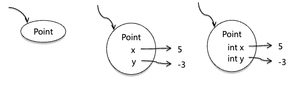

# Static Checking

Created: 2023년 9월 13일 오전 10:50

## **Hailstone Sequence**

→ 우박수열이라고도 함, 숫자가 커졌다 작아졌다를 반복하다 결국 1에 수렴하는 걸 비구름에서 빗방울이 오르락내리락하면서 우박이 되는 모습에 빗대어서 그렇게 부른다.

<aside>
💡  **T(n) = if n is even : n / 2 // if n is odd : 3 * n + 1**

</aside>

→ 이 함수 T(n)을 모든 자연수 n에 대해 유한번 재귀 반복하면 1로 간다는 추측이다.

- **n(even) = n / 2, n(odd) = 3n + 1**

```java
2, 1
3, 10, 5, 16, 8, 4, 2, 1
4, 2, 1
2n, 2n-1, ... , 4, 2, 1
5, 16, 8, 4, 2, 1
```

```java
int n = 3;
while( n != 1){
	System.out.println(n);
	if(n % 2 == 0)
			n = n / 2;
	else
			n = 3 * n + 1
}
System.out.println(n);
```

---

### Expression과 Statement의 차이

`**Statement(문장)**` : 프로그램내에서 하나의 동작을 기술하는 것.

자바에서 Statement는 블록({})안에 모여서 메서드와 클래스를 구성한다. Statement끝에는 항상 세미콜론;

**Statement에 포함되는 것:**

1. 변수 선언과 할당(Variable declaration and assiganment)
2. 조건문(Conditional statement)
3. 반목문(Loop-statement)

**`Expression(식)` : 값을 기술하는 것**

→ 식은 반드시 컴파일러에 의해 값으로 평과될 수 있어야한다. 즉, 식은 하나의 값으로 치환되는 것

**Expression에 포함되는 것:**

1. 함수 호출(method class)
2. 객체 할당(object allocations)
3. 산술식 등

→ 하나의 식으로 구성된 문장 = **`expression statement`**

**Expression Statement에 포함되는 것:**

1. 할당 표현식
2. 증감연산자
3. 메소드 호출
4. 객체 생성 표현식

```java
value = 8933.234; // 할당문
a++; // 증감문
System.out.println("안녕하세요"); // 메소드 호출문
자전거 myBike = new Bicycle(); // 객체 생성문
```

`**Keyword` : 하나의 라인을 구성하지만 값으로 환원될 수 없는 것들, 예를 들어 break, continue, return 등\*\*

---

## **Type**

**→ 타입은 값의 집합(set of values)과 연산(operations)의 집합이다.**

**Java의 Primitive types(8개)**

`byte` : 주로 이진데이터를 다루는데 사용된다. 범위 +-2^7(1byte)

`short` : int보다 적은 범위 +-2^15(2byte)

`int` : 5나 -200같은 경우이다. 범위는 +-2^31승으로 제한된다. 대략 20억 (4byte)

`long` : +-2^63 범위(8byte)

`boolean` : true or false

`double` : 소수점까지 표현되는 숫자, 실수의 하위부분도 표현된다.(8byte)
`floag` : 소수점까지 표현되는 숫자 f를 명시해주지 않으면 double형으로 인식함(4byte)

`char` : ‘A’ 같은 단일 문자의 경우

**다음과 같은 객체 유형도 있음**

`String` - 문자열과 같은 일련의 문자를 나타냄

`BinInteger` - int로 나타낼 수 없는 범위를 표현함

> **자바 규칙에 따라서 Primitive는 소문자로 시작하고 Objective는 대문자로 시작함.**

**연산(Operations)이란 입력을 받아 출력을 생성하는 함수다.(값 자체를 변경하는 경우도 있다.)**

---

## **Static Typing**

**→ 자바는 정적으로 타입이 지정되는 언어이다. 모든 변수의 유형은 컴파일 타임에 정해진다.**

## **Static Checking, Dynamic Checking, No Checking**

**Static checking: 프로그램이 실행되기전에 버그를 발견한다.**

**Dynamic checking: 코드가 실행될 때 버그를 발견한다.**

**No checking: 언어가 오류를 찾는데 도움되지않고 스스로 찾아야 한다.**

---

## **Primitive Type Are Not True Numbers**

**→ 프로그래밍에서 Primitive는 우리가 실제로 생각하는 것과 결과 다를 수 있음**

- **Integer division :** 5 / 2는 분수를 반환하지 않으면 정수 밑 부분이 제거된 정수를 반환한다. 그래서 이런 상황에서 종종 오류가 발생한다.
- **Integer overflow:** `int`나 `long`는 최소값과 최대값을 가지고 있는 유한한 값이다. 값이 너무 크거나 작으면 오버플로우가 발생해서 잘못된 값이 반환된다.
- **Special values in float and doubles:** float와 double는 실수가 아닌 특별한 값이 있다.`Nan`(Not a Number), `POSITIVE_INFINITY , NEGATIVE_INFINITY` 따라서 0으로 나누거나 잘못된 계산을 취하는 등 동적으로 오류가 발생 할 것 같다면 이러한 특별한 값들이 대신 생성된다.

---

## Arrays and Collections

**→ 자바에는 데이터 목록을 저장하기 위해선 배열과 List두 가지가 있다.**

### 배열

**→ 고정된 길이의 데이터를 저장 할 수 있는 곳. 생성되면 길이를 변경 할 수 없다.**

```java
int[] a = new int[100]; // <==== DANGER WILL ROBINSON
int[] i = 0;
int n = 3;
while(n != 1){
	a[i] = n;
	i++;
	if(n % 2 == 0){
		n = n / 2;
	}else{
		n = 3 * n + 1;
	}
}
a[i] = n;
i++;
```

**→ 만약 hailstone sequence가 아주 큰 값이라면 배열 100개로는 적합하지않은 버그를 가지고 있음.**

**→ 이 과정에서 오류가 생기는 것은 Dynamically catch가 되기때문에 알 수가 없다.**

**→ 그러므로 고정된 길이의 배열대신 List를 사용하면 가변길이의 List를 사용할 수 있다.**

### List

**→ 가변 길이의 데이터를 저장 할 수 있음. 생성 후 길이가 모자라면 자동으로 늘어난다.**

**→ 사용자가 직접 생성하지 않는다. 대신 List에서 제공하는 Operations를 사용한다.**

**→ `List<T>`에서 T위치에 `Primitive Type`은 안되고 `Reference Type`만 사용 할 수 있다. 그 이유는 실제 기본 값보다 더 많은 메모리를 사용할 수 있다는 것을 프로그래머에게 알려주기 위한 것이다.**

→ int는 Primitive Type으로 스택영역에서 4바이트로 저장됨

→ Integer은 Reference Type으로 힙영역에 저장된다.

**다른 상황에서는 자바가 자동으로 `int`와 `Integer`을 변환하므로 오류 없이 작성 할 수 있다.(`boxing`, `unboxing`)**

```java
// List로 변환하여 작성한 Hailstone Code
int n = 3;
while(n != 1){
		list.add(n);
		if(n % 2 == 0){
				n = n / 2;
		} else {
				n = 3 * n + 1;
		}
}
list.add(n);
```

**→ List가 메모리가 부족하지 않는한 자동으로 크기를 늘려주고 값을 추가해주기 때문에 더 간단하고 더 안전하다.**

---

### Iteration

**→ 배열이나 리스트에서 원소들에 접근하여 값을 찾아올 수 있다.**

---

### Methods

**→ 자바에서 명령문은 기본적으로 메서드내에 있어야한다. 그리고 모든 메서드는 클래스안에 있다.**

```java
public class Hailstone {
      /**
       * Compute a hailstone sequence.
       * @param n  Starting number for sequence.  Assumes n > 0.
       * @return hailstone sequence starting with n and ending with 1.
         */
    public static List<Integer> hailstoneSequence(int n) {
      List<Integer> list = new ArrayList<Integer>();
      while (n != 1) {
          list.add(n);
          if (n % 2 == 0) {
              n = n / 2;
          } else {
              n = 3 * n + 1;
          }
      }
      list.add(n);
      return list;
    }
  }
```

**→ 가장 단순한 hailstone program 만드는 방법**

- `**public`는 프로그램안에서는 메서드나 클래스를 참조 할 수 있음을 의미한다. pirvate 과 같은 다른 access modifier은 프로그램의 안정성을 높이고 `immutable type` 에 대한 불변성을 보장한다.\*\*

> `**Immutable type` : 객체 생성 이후 상태가 변하지 않는 객체 (뒤에서 다룸)\*\*

- `**stacic` 은 메서드가 this(self) 매개변수를 가지고 있지않다는 것을 의미한다. `object`에서는 `static method`를 호출 할 수 없다. ex) List - add(), String - length()\*\*

**→ 호출 방법으로는 `objec name`을 명시하는 대신 `class name` 를 명시해주어야한다.**

---

### Mutating Values vs. Reassigning Variables

→ `snapshot diagram` 은 우리에게 변수를 변경하는 것과 값을 변경하는 것을 구분하는 것을 구분하는 걸 시각화하게 해준다.

- 우리가 변수를 할당할 때 다른 변수로 가르킬 수 있다면 그 참조값으로 할당 할 수 있음

> ex)
>
> `Array` 또는 `List`와 같은 내부의 값이 변경가능한 곳에 값이 할당된다면 내부 참조값을 변경 할 수 있다.

`**Immutability` : 불변성은 일단 생성되면 상태가 변하지 않는 객체(적어도 외부에서는 보이지않는다.)\*\*

**→ immutable하게 객체를 생성한다면 Side-effect에 대한 걱정이 없으므로 설계, 구현 및 사용하는데 있어서 편리하다.**

- **자바에서는 한번 할당되고 다시 할당되지 않는 키워드를 제공함 - `final`**

→ `immutable reference` 에 대한 `Static checking`를 제공해주므로 변경에 대한 걱정이 없다.

<aside>
💡 **Local variable에만 `final`이 붙는게 아니라 메서드 파라미터에도 `final`적용 가능하다.**

</aside>

**→ 이에 대한 이점으로는 파라미터로 받아오는 인자에 대한 값 재할당을 금지하면서 데이터의 정합성을 유지 할 수 있음.**

> `**데이터의 정합성` : 어떤 데이터들의 값이 서로 일치하는 상태\*\*

---

`**Snapshot Diagram` : 프로그램이 돌아가는 동안 내부 상태를 표현한 것\*\*

**진행중인 메서드 및 해당 지역 변수 → Stack , 존재하는 Objects → Heap)**

### **Primitive values**

**: `Primitive values` 는 상수로 표시된다.**


### **Object values**

**: `Object values` 는 원으로 표시된다. 더 자세한 사항을 원할 때 내부에 값을 가르키는 `field name`를 명시한다.**



---

### Documenting Assumptions

**→ 변수를 선언할 때 타입을 적는 것은 컴파일 타임에 확인하고 위반 할 일이 없다는 것을 보장해준다.**

**→ `final` 키워드 쓰는것도 변수에 값을 처음 할당한 뒤 그 후로는 바꾸지 않겠다는 문서화의 형태이다. 그 후 자바에서 Static Check를 한다.**

> **왜 우리는 문서화를 해주어야할까?**

- **프로그램에는 코드들이 많아서 기록하지 않는다면 사용자들은 기억을 못하기때문에 나중에 프로그램을 읽거나 변경해야 할 때 알 수 없다. 그러므로 두가지 목표를 설정하고 작성하여야한다.**
  1. 컴파일단계에서 구문적으로 오류가 없는지 확인하고 런타임에 올바른 결과를 제공하도록 한다.
  2. 다른 사용자들이 유지보수 및 리팩토링 할 때 프로그램을 이해하기 쉽게 만들어야 한다.

---

### Hacking Vs. Engineering

**→ 지금까지 본 간편한 코드를 작성했는데 간편함은 종종 낙관주의를 이끌어낸다.**

**코드를 작성하는데에 있어서 안좋은 마인드**

1. 테스트를 하기전에 너무 많은 코드를 작성하는 것
2. 코드에 관한 정보를 영원히 기억할거라고 생각하고 세부사항을 명시하지 않는 것
3. 버그가 존재하지 않거나 찾기 쉽고 수정하기 쉽다고 생각하는 것

**********************\*\***********************\*\***********************\*\***********************코드를 작성하는데에 있어서 좋은 마인드**********************\*\***********************\*\***********************\*\***********************

1. 한번에 조금씩 작성하면서 테스트를 하는 것. → `test-first programming`
2. 코드에 대한 것을 문서화 하는 것
3. Static Checking를 통해 코드에 오류가 나오지 않도록 하는 것

---

### The Goal of 6.005

**→ 6.005를 배우면서 어떻게 소프트웨어를 제작하는지 방법에 대해 배운다.**

1. **버그로부터 안전하게 만들기 : Correctness(정확하게 행동하는 것), Defensiveness(미래에도 올바르게 행동하는 것)**
2. **쉽게 이해하기 : 적어놓지 않는다면 미래에 다시 읽으면 이해하기 힘들다. 미래의 좋은 디자인을 하는데 얼마나 도움이 될지 알 수 있다.**
3. **변화 준비 : 소프트웨어는 항상 변경된다. 많은 변화없이 최대한 쉽게 바꿀 수 있도록 해야한다.**

---

### Summary

**→ 이 단원에서 공부한 주요 주제는 Static Checking (정적 검사)이다.**

1. **버그로부터 안전해진다 : `Static Checking`는 `Runtime` 이전에 type eroor등을 catch하여 안전하게 만들어준다.**
2. **이해하기 쉽다 : 코드에 정확하게 타입이 명시되어 있으므로 그대로 이해하면 된다.**
3. **변화에 대응 할 수 있다 : `Static Checking` 를 사용하면 동시에 변경하는 곳도 식별하기 쉬어 코드를 쉽게 변경 할 수 있다.**

   **ex) 변수의 이름이나 타입을 변경하면 컴파일러는 해당 변수가 사용되는 모든 위치에 오류를 표시**
