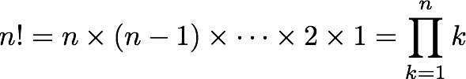
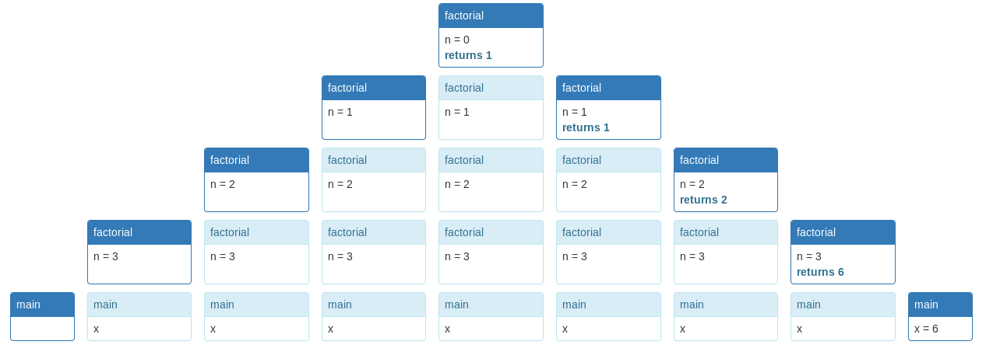

= Reading 10: Recursion
Reference by <http://web.mit.edu/6.005/www/fa15/classes/10-recursion/>
v1.0, 2023-09-27

.Objectives
. recursive문제를 recursive stpes 와 base case로 분해할수 있다.
. recursive에서 helper method를 언제 어떻게 사용하는지 알 수 있다.
. recursive와 iteration의 장단점을 이해하고 그 차이점 파악할 수 있다.

== Recursion
* recursion은 모든 문제에 적합하진 않지만, software development toolbox에서 중요한 도구중 하나

* recursive function은 base cases와 recursive Steps로 정의됩니다.
** base case에서는 function call의 input으로 즉시 결과를 계산
** recursive step에서는 동일한 함수에 대해 한번 이상의  recursive call을 사용해 결과를 계산하지만, 입력의 크기나 복잡성은 base case에 더 가깝게 감소. 

.예를들어 factorial은 두 가지 다른 방법으로 정의 할수있다.

.곱셈

** 이 경우에서는 초기값은 다음과 같이 곱셈 항등원 "1"로 정의

.재귀 관계

image::image/reading10/factorial-recurrence.png[]

* 두가지 정의로 인해 두 가지 다른 구현 방법이 나타납니다.

[source, java]
----
[Iterative]
public static long factorial(int n) {
  long fact = 1;
  for (int i = 1; i <= n; i++) {
    fact = fact * i;
  }
  return fact;
}

[Recursive]
public static long factorial(int n) {
  if (n == 0) {
    return 1;
  } else {
    return n * factorial(n-1);
  }
}
----
* recursive 구현에서의 base case는 n=0인 경우입니다.
** 즉 0!(팩토리얼 0)은 1로 정의
** recursive step은 n>0인 경우이며, (n-1)!값을 얻기 위한 recursive call을 통해 결과를 계산하고, 그 결과에 n을 곱하여 계산을 완료함.

* 재귀 함수의 실행을 시각화를 위해 call stack을 계산 진행될 때마다 다이어그램으로 그려보았다.

----
public static void main(String[] args) {
    long x = factorial(3);
}
----

* Fractorial에 대한 interactive visualization을 제공하며 새로운 스택 프레임이 이전 스택 프레임 아래로 성장하는 방식으로 표현됩니다.

* 다른 예제로 피보나치 수열이 있으며 다음과 같이 정의.

[source, java]
----
/**
 * @param n >= 0
 * @return the nth Fibonacci number 
 */
public static int fibonacci(int n) {
    if (n == 0 || n == 1) {
        return 1; // base case
    } else {
        return fibonacci(n-1) + fibonacci(n-2); // recursive step
    }
}
----

* 피보나치 수열은 n=0, n=1과 같은 여러가지 기본 사례를 가지고 있습니다.

== Choosing the Right Decomposition for a Problem

* 아래 코드는 주어진 문자열 ``word``의 모든 부분 문자열을 구하는 메서드인 ``subsequences``를 재귀적으로 구현

[source, java]
----
/**
 * @param word는 A-Z 또는 a-z의 글자로만 구성됩니다.
 * @return 쉼표로 구분된 word의 모든 부분 문자열입니다.
 * 하위 문자열은 word에서 나타나는 순서와 동일한 순서로 글자 문자열입니다.
 */
public static String subsequences(String word)
----
예를 들어 `subsequences("abc")` 는 ,a,b,ab,c,ac,bc,abc 와 같이 반환됩니다.

. 먼저 메서드는 문자열이 비어있는 경우 (base case) 빈 문자열 반환
. 그렇지 않다면, 문자열의 첫 번째 글자를 추출하고 나머지 부분 문자열 생성
. 나머지 부분 문자열에 대해 recursive로 ``subsequences``메서드를 호출해 부분 문자열의 집합을 얻는다.
. 그 다음, 이 부분 문자열 집합을 쉼표로 분할 하고 각 부분 문자열 앞에 첫 번째 글자를 추가해 새로운 부분 문자열 집합을 형성
. 마지막으로, 결과 문자열의 앞에 붙어 있는 추가 쉼표를 제거하고 결과를 반환.

[source, java]
----
public static String subsequences(String word) {
    if (word.isEmpty()) {
        return ""; // 기본 사례
    } else {
        char firstLetter = word.charAt(0);
        String restOfWord = word.substring(1);
        
        String subsequencesOfRest = subsequences(restOfWord);
        
        String result = "";
        for (String subsequence : subsequencesOfRest.split(",", -1)) {
            result += "," + subsequence;
            result += "," + firstLetter + subsequence;
        }
        result = result.substring(1); // 추가된 선행 쉼표 제거
        return result;
    }
}
----

== Structure of Recursive Implementations

.recursive implementation의 두가지 구성

. **base case**: 더 이상 분해할 수 없는 가장 간단하고 작은 문제를 나타냄. base case는 종종 비어있는 상태를 나타내며, 예를 들어 빈 문자열, 집합, 트리, 또는 숫자 0등이 될 수 있다.

. **recursive step**: 재귀 단계에서는 더 큰 문제 인스턴스를 하나 이상의 더 간단하거나 작은 인스턴스로 분해하고, 그 하위 문제들의 결과를 재귀 호출을 통해 다시 결합해 원래 문제의 해결책을 생성.

* 중요한 것은 recursive step에서 문제 인스턴스를 더 작은 것으로 바꾸는 것. 그렇지 않다면, 재귀가 끝나지 않을 수 있다.모든 recursive step이 문제를 축소시키고 base case가 가장 아래 있는 경우 recursive의 종료는 보장된다.

* recursive implementation은 base case나 recursive step을 하나 이상 가질수있으며, 예를 들어 피보나치 함수는 n=0,n=1 두개의 기본 base case를 가지고있습니다.

== Helper Methods

* 위 subsequences()머세드처럼 가장 작은 부분 문제로 분해하는것이 일반적이나, 경우에 따라 재귀 단계를 더욱 단순하게 또는 우아하게 만들기 위해 recursive step에 대한 더 강력하거나 다른 spec이 필요하다.

[source, java]
----
/**
 * 상기 정의된 것과 같은 단어의 모든 부분 수열을 쉼표로 구분하여 반환
 * 각 부분 수열 앞에는 partialSubsequence가 추가됩니다.
 */
private static String subsequencesAfter(String partialSubsequence, String word) {
    if (word.isEmpty()) {
        // base case
        return partialSubsequence;
    } else {
        // recursive step
        return subsequencesAfter(partialSubsequence, word.substring(1))
             + ","
             + subsequencesAfter(partialSubsequence + word.charAt(0), word.substring(1));
    }
}
----

* subsequencesAfter()메서드는 Helper methods라고 합니다. 기존 메서드와 다른 spec을 가지기 때문. 왜냐면, 세가지의 매개변수가 있기 때문

* 구현을 완료하려면 원래 subsequences 명세를 구현

[source, java]
----
public static String subsequences(String word) {
    return subsequencesAfter("", word);
}
----

* client에게 **"helper method"**를 노출시키지 않는게 중요.
* 재귀는 이런식으로 분해하기로 한 결정은 구현에 따라 다르다.

== Choosing the Right Recursive Subproblem

* 정수를 주어진 진법을 사용해 문자열 표현으로 변환하는 메서드를 재귀적으로 구현하는 예제

[source, java]
----
/**
 * @param n 문자열로 변환할 정수
 * @param base 사용할 진법. 2<=base<=10이어야 합니다.
 * @return 정수 n을 주어진 진법의 숫자 문자열로 표현한 결과입니다. 음수인 경우 앞에 마이너스 기호가 붙습니다.
 */
public static String stringValue(int n, int base)
----

* 예를들어 (16,10)은 "16"을 반환하며, (16,2)는 "1000"을 반환합니다.

[source, java]
----
if (n < 0) return "-" + stringValue(-n, base);
----

* 이로써 재귀 하위 문제를 더 작거나 더 간단하게 처리할 수 있음을 보여줍니다.

* 우리가 정수를 특정 진법으로 표현할 때, 일반적으로 가장 왼쪽에서부터 오른쪽으로 씁니다. 예를들어 829를 10진법으로 쓸때 가장 왼쪽은 8 , 2 , 9 순서입니다.
* 문제는 어떻게 이 숫자를 재귀적으로 표현하냐 입니다.

[source, java]
----
return stringValue(n/base, base) + "0123456789".charAt(n%base);
----
 * 문제를 분해하는 여러 방법을 생각해야한다. base case가 무엇인지 찾고 구별할줄 알아야한다.

== Recursive Problems VS Recursive Data

* 작업중인 데이터가 본질적으로 재귀적인 구조를 가지고 있는 경우
* 예를들어 모든 컴퓨터에 있는 recursive data에 대해 알아본다. 파일 시스템은 이름이 지정된 파일로 구성. 일부 파일은 폴더로서, 다른 파일을 가질 수 있다. 따라서 파일 시스템은 재귀적.
** 폴더는 다른 폴더를 가질 수 있으며, 재귀의 맨 아래는 일반 파일이 있다.

* 자바 라이브러리 파일 시스템은 java.io.File을 사용한다.
** 이것은 파일 f의 부모 폴더를 나타내며, f.getParentFile()메서드와 f폴더에 포함된 파일을 나타내는 f.listFiles()메서드가 있는 재귀 데이터 유형입니다.

* 재귀 데이터의 경우, 재귀적인 구현이 자연스럽다.

[source, java]
----
/**
  *
  *@param f 파일 시스템의 파일
  *@return 파일 시스템의 루트에서 파일 f의 전체 경로 이름
  */
public static String fullPathname(File f) {
    if (f.getParentFile() == null) {
        // base case: f가 파일 시스템의 루트에 있음
        return f.getName();
    } else {
        // recursive step
        return fullPathname(f.getParentFile()) + "/" + f.getName();
    }
}
----

* 최신 버전의 자바는 파일 시스템과 파일 이름을 지정하는 데 사용되는 경로를 더 깔끔하게 분리하는 java.nio.Files및 java.nio.Path라는 새로운 API가 추가되었지만, 데이터 구조 자체는 여전히 본질적인 재귀이다.

== Reentrant Code(재진입 코드)

* Recursive는 메서드가 자기 자신을 호출하는 것을 의미하며, 이것은 프로그래밍의 일반적인 개념인 Reentrancy(재진입성)의 특별한 경우입니다. 재진입 가능한 코드는 다시 호출되더라도 안전하게 작동해야한다. 이를 위해 코드의 상태를 parameter와 Local variable에 저장하고 static variable이나 global variable의 사용은 하지말아야 하며, 다른 부분과 alyasing을 공유하면 안된다.

* Direct recursion(직접 재귀)는 메서드 내에서 자기 자신을 호출하는 것으로, 팩토리얼 함수와 같은 예시에서 볼 수 있다. 
* Mutual recursion(상호 재귀)는 두개 이상의 함수가 서로를 호출하는 것으로 프로그래머에 의해 의도적으로 설계된다. 또한 버그를 일으킬 수 있다.

.Reentrancy는 코드를 안전하게 만들고, concurrent(동시성)프로그래밍, 콜백 함수, 상호 재귀 등에서 사용하도록 도와준다.

== Iteration대신 Recursion을 사용하는 경우

. 문제가 자연스럽게 재귀적인 특성을 가질 때(예. 피보나치 수열)
. 데이터가 자연스럽게 재귀적인 구조를 가질 때(예. 파일 시스템)

. 또 다른 이유는 Immutability(불변성)을 더 잘 활용하기 위함이다. 
** 이상적인 재귀 구현에서는 모든 변수가 변경이 불가능하며, 모든 데이터가 immutable이며, 재귀 메서드는 side-effect없이 순수한 함수로 작동하며, 이러한 패러다임을 functional programming이라하며, 로프와 변수를 사용하는 명령형 보다 이해하기 쉽다.

. 메모리 사용량이 중요하지 않은 경우
** 재귀적인 해결책은 호출 스택을 만들어 메모리를 일시적으로 소비하므로, 스택의 크기가 제한이 있을 수 있다. 재귀 구현이 해결 가능한 문제의 크기에 제한을 두어야 한다.

* 즉 요약하면, 재귀는 문제나 데이터가 재귀적인 특성을 가지며, 불변성과 순수성을 강조하고자 할 때 사용한다. 하지만 메모리를 많이 잡아먹으므로 주의하자.

== recursive implementation에서 흔히 발생하는 오류

. base case부재 또는 모든 기본 경우가 다루지 않는 경우:
** 재귀 함수에서는 문제를 더 이상 분할하지 않고 종료해야 하는 base case가 필요, 이것이 없다면 무한루프에 빠진다.

. recursive step이 더 작은 subproblem으로 충분히 축소되지 않은 경우:
** 문제가 더 작은 subproblem으로 충분히 분할되지 않는 경우, 재귀가 수렴하지 않고 무한 반복할 수 있다. 재귀적으로 문제를 해결 할 때는 각 단계에서 원래 문제를 더 작고 해결 가능한 하위 문제로 분해해야함.

* 이러한 오류를 디버깅할 때 주의해야한다.

* 긍정적인 측면에서 iterative implementation에서 무한 루프는 recursive implementation에서는 StackOverflowError와 같은 오류가 발생한다. 따라서 재귀 프로그램은 더 빨리 실패하므로 이것이 디버깅에 도움이 될 수 있다. 

== 정리

.오늘의 개념
. recursive problems and recursive data
. recursive problem의 대안 분해 비교
. recursive step을 강화하기 위해 helper method 사용
. recursion vs iteration

.Safe from bugs
* 재귀 코드는 더 간단하고 변경 불가능한 변수와 불변 객체를 사용하기에 버그로부터 안전

.Easy to understand
* 자연스러운 재귀적 문제와 재귀적 데이터에 대한 재귀적 구현은 종종 반복적인 해결보다 짧고 이해하기 쉽다.

.Ready for change
* 재귀 코드는 자연스럽고 재진입 가능(reentrant)하므로 버그로부터 더 안전하고 다양한 상황에서 사용할 준비가됬따
