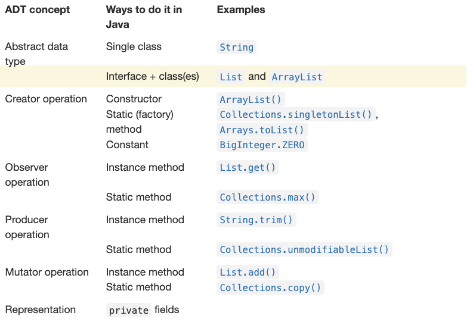

# Interfaces

## Objective

수업 주제는 인터페이스이다. Abstract data tyep의 인터페이스를 구현에서 분리하고 Java의 `interface` 유형을 사용하여 이러한 분리를 시행하는 것이다.

목표는 인터페이스로 Abstract Data Type를 정의하고 인터페이스를 구현하는 클래스를 작성할 수 있을 것이다.

---

## Interfaces

- **Java의 `Interface` 는 abstract data type를 표현하는데 유용한 언어 메커니즘이다.**
- **Java의 인터페이스는 method signatures의 목록이지만 메소드의 몸체는 아님.**
- **클래스는 인터페이스를 `implements`하고 인터페이스의 모든 메서드를 구현한다.**

따라서 Java에서 Abstract Data Type를 정의하는 한 가지 방법은 해당 인터페이스를 구현하는 클래스로 구현하는 인터페이스이다.

**접근 방식의 장점 1: 인터페이스가 클라이언트에 대한 계약만 지정한다는 것이다.** 

**→ 클라이언트가 ADT를 이해하기 위해서는 인터페이스만 읽으면 된다.**

**인스턴스 변수를 인터페이스에 전혀 넣을 수 없기 때문에 클라이언트는 의도하지 않은 종속성을 생성할 수 없다. → 구현이 완전히 분리됨**

**접근 방식의 장점 2: 추상 데이터 유형의 여러 가지 다른 표현이 인터페이스를 구현하는 다른 클래스와 같이 동일한 프로그램에 공존할 수 있다.** 

**ADT가 인터페이스 없이 단일 클래스로 표현되는 경우 여러 표현을 갖는것이 더 어렵다.**

**Abstract Data Types의 단원 예제인 `MyString` 는 단일 클래스였다.**

→ **우리는 `MyString` 에 대한 두 가지 다른 표현을 탐색했지만 동일한 프로그램에서 ADT에 대한 두 가지 표현을 모두 가질 수는 없었음**

**Java에 Static type checking를 통해 컴파일러는 ADT 구현시 일어나는 많은 실수를 찾아낼 수 있다.** 

**ex) 필수 메서드 중 하나를 생략하거나 메서드에 잘못된 반환 유형을 제공하는 것은 컴파일 타임 에러**

**→ 하지만 컴파일러는 코드가 주석에 작성된 메서드의 스펙을 준수하는지는 확인 할 수 없다.**

---

## **Example: `MyString`**

`**MyString` 를 다시 살펴보자. ADT용 클래스 대신 인터페이스를 사용하면 여러 구현을 지원할 수 있습니다.**

```java
/** MyString represents an immutable sequence of characters. */
public interface MyString { 

    // We'll skip this creator operation for now
    // /** @param b a boolean value
    //  *  @return string representation of b, either "true" or "false" */
    // public static MyString valueOf(boolean b) { ... }

    /** @return number of characters in this string */
    public int length();

    /** @param i character position (requires 0 <= i < string length)
     *  @return character at position i */
    public char charAt(int i);

    /** Get the substring between start (inclusive) and end (exclusive).
     *  @param start starting index
     *  @param end ending index.  Requires 0 <= start <= end <= string length.
     *  @return string consisting of charAt(start)...charAt(end-1) */
    public MyString substring(int start, int end);
}
```

**우리는 static인 `valueOf` 메소드를 생각하지 않고 나중에 생각할 것이다. 대신 Java의 ADT개념 도구 상자와는 다른 기술인 생성자를 사용해 보겠다.**

**첫 번째 구현은 다음과 같다.**

```java
public class SimpleMyString implements MyString {

    private char[] a;

    /* Create an uninitialized SimpleMyString. */
    private SimpleMyString() {}

    /** Create a string representation of b, either "true" or "false".
     *  @param b a boolean value */
    public SimpleMyString(boolean b) {
        a = b ? new char[] { 't', 'r', 'u', 'e' } 
              : new char[] { 'f', 'a', 'l', 's', 'e' };
    }

    @Override public int length() { return a.length; }

    @Override public char charAt(int i) { return a[i]; }

    @Override public MyString substring(int start, int end) {
        SimpleMyString that = new SimpleMyString();
        that.a = new char[end - start];
        System.arraycopy(this.a, start, that.a, 0, end - start);
        return that;
    }
}
```

**이에 대한 최적화 구현은 다음과 같다.**

```java
public class FastMyString implements MyString {

    private char[] a;
    private int start;
    private int end;

    /* Create an uninitialized FastMyString. */
    private FastMyString() {}

    /** Create a string representation of b, either "true" or "false".
     *  @param b a boolean value */
    public FastMyString(boolean b) {
        a = b ? new char[] { 't', 'r', 'u', 'e' } 
              : new char[] { 'f', 'a', 'l', 's', 'e' };
        start = 0;
        end = a.length;
    }

    @Override public int length() { return end - start; }

    @Override public char charAt(int i) { return a[start + i]; }

    @Override public MyString substring(int start, int end) {
        FastMyString that = new FastMyString();
        that.a = this.a;
        that.start = this.start + start;
        that.end = this.start + end;
        return that;
    }
}
```

- **이러한 클래스를 Abstract Data Type의 `MyString` 과 비교해 봐라. 이전에 Static `valueOf`  메서드에 표시되었던 코드가  이제 생성자에 어떻게 표시되는지 확인해보아라. 이 코드의 표현을 참조하기 위해 약간 변경되었다.**
- **또한 `@Override` 사용에 주의해라. 이 애노테이션은 메소드가 우리가 구현하는 인터페이스의 메소드 중 하나와 동일한 시그니처를 가져야 함을 컴파일러에 알린다. 그러나 컴파일러는 우리가 모든 인터페이스 메소드를 구현했는지 이미 확인했기 때문에 여기서 `@Override`의 주요 값은 코드 독자를 위한 것이다. 즉, 인터페이스에서 해당 메소드의 스펙을 찾도록 지시한다. 스펙을 반복하는 것은 DRY가 아니지만 언급하지 않으면 코드를 이해하기가 더 어려워진다.**
- **그리고 해당 표현을 데이터로 채우기전에 `substring(..)` 에서 새 인스턴스를 만드는 데 사용하는 비공자 ctor을 확인해라.  Java는 기본적으로 이러한 빈 생성자를 제공했기 때문에 이전에는 이러한 기본 생성자를 작성 할 필요가 없었다. `boolean b` 를 사용하는 생성자를 추가한다는 것은 다른 생성자를 명시적으로 생성해야한다는 것을 의미한다.**

**이제 우리는 좋은 ADT가 자신의 invariant를 보존한다는 것을 알았으므로 아무것도 하지 않는 생성자는 안티 패턴이다. 그들은 표현에 값을 할당하지 않으며 확실히 어떠한 invariant를 설정하지 않았다. 구현을 수정하는 것을 강력히 고려해야한다. →  `MyString`은 immutable이기 때문에 시작점은 모든 필드를 final로 만드는 것이다.**

**클라이언트는 이러한 ADT를 어떻게 사용해야 할까? 예는 다음과 같다.**

```java
MyString s = new FastMyString(true);
System.out.println("The first character is: " + s.charAt(0));
```

**이 코드는 Java 컬렉션 클래스를 사용하기 위해 작성하는 코드와 매우 유사하다.**

```java
List<String> s = new ArrayList<String>();
...
```

**불행하게도 이 패턴을 우리가 Abstract type과 구현사이에 구축하기 위해 열심히 노력한 `Abstraction barrier`을 허물었다. 클라이언트는 구체적인 구현 클래스의 이름을 알아야 한다. Java의 인터페이스는 생성자를 포함할 수 없기 때문에 구체적인 클래스의 생성자 중 하나를 호출해줘야 한다. 생성자의 스펙은 인터페이스 어디에도 표시되지 않기 때문에 서로 다른 구현이 동일한 생성자를 제공한다는 보장은 없다.**

`Abstraction barrier` : 클라이언트는 소프트웨어가 어떻게 작동하는지 알 필요가 없고 구현하는 사람은 클라이언트가 어떻게 사용해야 할지는 알 필요 없음. 그 두 부분으로 나누는 것을 Abstraction barrier이라고 한다. 

**다행스럽게도(Java 8부터) 인터페이스는 `Static method` 를 포함할 수 있으므로 생성자 작업 `valueOf` 를 `MyString` 인터페이스의 static factory method 메서드를 구현 할 수 있다.**

```java
public interface MyString { 

    /** @param b a boolean value
     *  @return string representation of b, either "true" or "false" */
    public static MyString valueOf(boolean b) {
        return new FastMyString(true);
    }

    // ...
```

이제 클라이언트는 Abstraction barrier을 깨지 않고 ADT를 사용할 수 있다.

```java
MyString s = MyString.valueOf(true);
System.out.println("The first character is: " + s.charAt(0));
```

---

## Example: `Set`

**Java의 컬렉션 클래스는 인터페이스와 구현을 분리하는 아이디어의 좋은 예를 제공한다.**

**Java 컬렉션 라이브러리의 ADT 중 하나인 `Set`를 예로 들어 보겠다. `Set` 은 다른 유형 E의 유한 요소 집합의 ADT이다. 다음은 Set 인터페이스의 단순한 버전이다.**

```java
/** A mutable set.
 *  @param <E> type of elements in the set */
public interface Set<E> {
```

**Set은 지네릭 타입의 예시이다. 스펙이 나중에 채워질 타입에 관해 다룬다. `Set<String>` , `Set<Integer>` 등에 별도에 스펙과 구현을 작성하는 대신 `Set<E>` 에 대해서만 다룬다.**

**우리는 creator부터 시작하여 Java interface를 ADT operation의 분류와 일치시킬 수 있다.**

```java
// example creator operation
    /** Make an empty set.
     *  @param <E> type of elements in the set
     *  @return a new set instance, initially empty */
    public static <E> Set<E> make() { ... }
```

`**make` operation은 static factoryy method이다. 클라이언트는 이와 같이 코드를 사용할 수 있다.**

`**Set<String> strings = Set.make();`** 

**그리고 컴파일러는 새로운 `Set`이 `String` 객체를 다루는 것을 알 수 있다.**

```java
// example observer operations

    /** Get size of the set.
     *  @return the number of elements in this set */
    public int size();

    /** Test for membership.
     *  @param e an element
     *  @return true iff this set contains e */
    public boolean contains(E e);
```

**다음은 observer에 관한 두가지 메서드이다. Set에 대한 추상적인 개념의 관점에서 스펙이 어떻게 되어있는지 주목해라.** 

**→ 특정 private field가 있는 Set의 구현에 대한 세부 정보를 언급하는 것은 잘못된 형식다.** 

**이러한 스펙은 set ADT의 모든 valid한 구현에 적용되어야 한다.**

```java
// example mutator operations

    /** Modifies this set by adding e to the set.
     *  @param e element to add */
    public void add(E e);

    /** Modifies this set by removing e, if found.
     *  If e is not found in the set, has no effect.
     *  @param e element to remove */
    public void remove(E e);
```

**mutator은 기본적으로 observer와 비슷하다. 우리는 여전히 set의 abstract model수준에서 스펙을 작성한다.**

---

## Why Interfaces?

인터페이스는 실제 Java 코드에서 광범위하게 사용된다. 모든 클래스가 인터페이스와 연결되어 있는 것은 아니지만 인터페이스를 그림으로 가져오는 데에는 몇 가지 좋은 이유가 있다.

- **컴파일러와 사람 모두를 위한 문서다 :** 인터페이스는 컴파일러가 ADT 구현 버그를 잡는 데 도움이 될 뿐만 아니라, 구체적인 구현을 위한 코드보다 사람이 읽는 데 훨씬 더 유용하다. 이러한 구현은 ADT 타입 및 스펙을 흩 뿌리게한다.
- **성능 절충을 허용한다 :** ADT의 다양한 구현은 매우 다른 성능 특성을 갖는 메서드를 제공할 수 있다. 다양한 애플리케이션은 다양한 선택으로 더 잘 작동할 수 있지만 우리는 이러한 애플리케이션을 표현 독립적인 방식으로 코딩하고 싶다. 정확성의 관점에서 볼 때 간단하고 지역화된 코드 변경을 통해 핵심 ADT의 새로운 구현을 중단하는 것이 가능해야 한다.
- ****************************선택적 방법 :**************************** Java 표준 라이브러리의 `List` 는 모든 mutator메서드를 선택사항으로 표시한다. 이러한 메서드를 지원하지 않는 구현을 구축함으로써 `immutable List`를 제공할 수 있다. 일부 작업은 `immutable` 에서 충분한 성능을 구현하기 어렵기 때문에 `mutable` 한 구현도 원한다. mutator를 호출하지 않는 코드는 두 종류의 목록 모두에서 자동으로 작동할 수 있도록 만든다.
- ******************************************************************************하나의 클래스에 대한 다중 보기 :****************************************************************************** Java 클래스는 여러 메소드를 구현할 수 있다. 예를 들어 드롭 다운 목록을 표시하는 사용자 인터페이스 위젯은 위젯이자 목록으로 보는 것이 당연하다. 이 위젯의 클래스는 두 인터페이스를 모두 구현할 수 있다. 즉 단지 다른 데이터 구조를 선택한다는 이유로 ADT를 여러번 구현하지 않고 여러 가지 구현을 할 수 있다.
- ******************************************************************************************************************점점 더 신뢰할 수 있는 구현이 줄어들고 있다 :****************************************************************************************************************** 인터페이스를 여러 번 구현하는 또 다른 이유는 정확하다고 생각하는 간단한 구현을 쉽게 구축할 수 있는 반면, 버그가 포함될 가능성이 더 높은 멋진 버전을 구축하기 위해 더 열심히 노력할 수 있기 때문이다. 버그에 물리는 것이 얼마나 나쁜지에 따라 애플리케이션 구현을 선택할 수 있다.

---

## Realizing ADT Concepts in Java

첫 번째 ADT 읽기에서 ADT 개념의 Java 도구 상자를 확장 할 수 있다.



---

## Summary

java 인터페이스는 abstract data type의 아이디어를 유형에서 지원해야 하는 작업 세트로 공식화하는 데 도움이 됩니다.

이는 우리의 코드를 만드는 데 도움이 된다.

- **SFB :** ADT는 작업으로 정의되며 인터페이스가 바로 그 역할을 한다. 클라이언트가 인터페이스 유형을 사용할 때 정적 검사는 인터페이스에서 정의된 메서드만 사용하는지 확인한다. 구현 클래스가 다른 메서드를 노출하는 경우(더 나 쁘게는 abstraction barrier이 깨진 경우) 클라이언트는 실수로 해당 메서드를 보거나 의존할 수 없다. 데이터 유형의 구현이 여러 개 있는 경우 인터페이스는 메서드 시그니처에 대한 static checking를 제공한다.
- **ETU :** 클라이언트와 유지 관리자는 ADT 스펙을 어디서 찾을 수 있는지 정확히 알고 있다. 인터페이스에는 인스턴스 필드나 인스턴스 메서드 구현이 포함되어 있지 않으므로 스펙에서 구현 세부 정보를 유지하는 것이 더 쉽다.
- **RFC** : 인터페이스를 구현하는 클래스를 추가하는 유형의 새로운 구현을 쉽게 추가할 수 있다. static factory method를 선호하여 생성자를 피한다면 클라이언트는 인터페이스만 볼 수 있다. 이는 코드를 전혀 변경하지 않고도 클라이언트가 사용하는 구현 클래스를 전환할 수 있음을 의미한다.