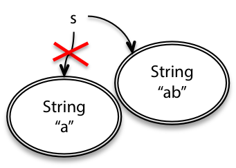

# Reading 2: Basic Java

# Snapshot Diagrams

> Runtime에 프로그램 내부의 상태를 나타낸다
> 

- 진행중인 method와 지역 변수들을 담는 영역인 `stack`
- 현재 존재하는 객체를 담는 영역인 `heap`

## Why we use Snapshot Diagram?

- To illustrate concepts like primitive types vs. object types, immutable values vs. immutable refercence, pinter aliasing, stack vs. heap, abstractions vs. concrete representations.

# Primitive Values

- Primitive value들은 `bare constants` 로 표현된다
- 들어오는 화살표는 변수나 object field의 값에 대한 참조

# Object Values

- Object value들은 그들의 타입에 따라 레이블이 지정된 원이다
- 더 자세한 것을 보여주고 싶다면, 우리는 Object 안에 있는 field name을 그들의 값을 가리키는 화살표와 함께 작성한다

# Mutating Value vs. reassigning variables

> Snapshot diagram은 변수를 변경하는 것과 값을 변경하는 것 사이의 차이를 시각화시켜 줄 수 있다
> 
- 우리가 변수나 field에 할당할 때, 변수의 arrow point가 가리키는 위치를 변경시킨다
- contents나 mutable value에 접근하려고 할 때(array, list…) 값 내부의 reference를 변경시킨다

## Reassignment and immutable values

```java
String s = "a";
s = s + "b";
```



- `String` 은 `immutable type` 이므로 한번 생성하면 값을 절대 변경할 수 없음
- Diagram에서 이러한 타입은 double border로 표현함

## Mutable values

```java
StringBuilder sb = new StringBuilder("a");
sb.append("b");
```


- `StringBuilder` 는 `mutable object` 이므로 object의 값을 변경할 수 있음
- `mutability` 와 `immutability` 는 bug로부터의 code safe를 만드는 데에 중요한 역할을 한다

## Immutable references

> 여기서 갑자기 왜 Immutable/Mutable values를 설명하다가
Immutable reference를 설명하는가? 생각해보기
> 

```java
final int n = 5;
```


- `Java` 에서 `final` 키워드를 사용하면 reference immutable 을 만들 수 있다
- 한번 할당하면 다시 할당할 수 없음
- Compiler error(Static Check)가 가능하도록 한다

```java
Notice that we can have an immutable reference to a mutable value (for example: final StringBuilder sb) whose value can change even though we’re pointing to the same object.

We can also have a mutable reference to an immutable value (like String s), where the value of the variable can change because it can be re-pointed to a different object.
```

### 알아두어야 할 점

`final StringBuilder`

- `immutable reference` , `mutable value`
- 같은 Object를 참조하고, 값을 변경시킬 수 있음

`String s`

- `mutable reference`, `immutable value`
- 값을 변경시킬 수는 없지만, 참조를 변경할 수는 있음(다른 객체를 가리킬 수 있음)

# Java Collections

---

## List, Set, Map

### List

- list.add(e)
- list.size()
- list.isEmpty()

### Set: cannot appear in a set multiple times

- s1.contains(e)
- s1.containsAll(s2) : s2가 s1의 부분집합인지
- s1.removeAll(s2)   : s2의 요소들을 s1에서 삭제

### Map: key → Hashable

- map.put(key, val)
- map.get(key)
- map.containsKey(key)
- map.remove(key)

## Literals

> 리터럴은 데이터(값) 그 자체를 뜻한다. 즉, 변수에 넣는 변하지 않는 데이터를 의미
> 

```java
const a = 1;
// a is constant
// 1 is lteral
```

- const - 메모리 위치(공간), 메모리 값을 변경할 수 없음
- Literal - 메모리 위치 안에 저장되는 값

```java
String[] arr = { "a", "b", "c" };
// this creates an array, not a List
Arrays.asList(new String[] { "a", "b", "c" })
// using provided utility function to create a List
```

## Generics

Java Collections는 collection에 속한 object의 type을 제한한다

원소를 추가하려고 하면, 컴파일러가 Static checking을 수행할 수 있음

반대로 원소를 빼내려고 할 때에도, 그것의 타입이 무엇인지 알 수 있음

다음과 같이 타입을 지정할 수 있음

```java
List<String> cities;
Set<Integer> numbers;
Map<String,Turtle> turtles;
```

하지만 primitive type에 대한 collection은 만들 수 없음 `List<int>`

이러한 Wrapper type들을 쉽게 사용할 수 있게 하기 위하여 Automatic Conversion을 지원함

```java
sequence.add(5);              // add 5 to the sequence
int second = sequence.get(1); // get the second element
```

- `List` - `ArrayList`, `LinkedList`
- `Set` - `HashSet`, `TreeSet`
- `Map` - `HashMap`

# Reference

---

[Background: How We Got the Generics We Have: (Or, how I learned to stop worrying and love erasure)](https://openjdk.org/projects/valhalla/design-notes/in-defense-of-erasure)