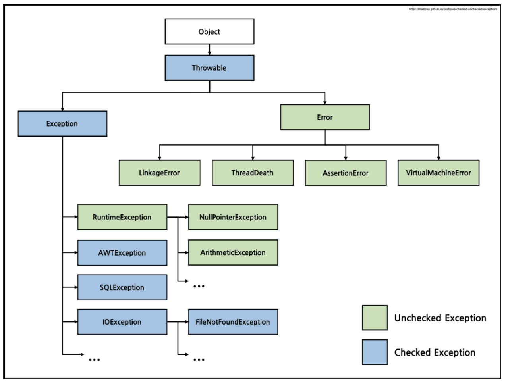

= Reading 6 : Exceptions
Reference by <http://web.mit.edu/6.005/www/fa15/classes/06-specifications/exceptions/>
v1.0, 2023-09-23

* method's signature(이름, parameter types, return type)은 해당 메서드의 specification의 핵심 부분이며 +
 signature에는 메서드가 발생시킬 수 있는 예외도 포함될 수 있습니다.

== Exceptions for signaling bugs

* 이미 자바 프로그래밍 중에 ArrayIndexOutOfBoundsException(배열 인덱스가 유효한 범위를 벗어났을때 throw되는 예외) +
NullPointerException(널 객체 참조에서 메서드 호출 하려고 할때 throw되는 예외) +
같은 예외는 일반적으로 코드 내의 버그를 나타내며, 이러한 예외는 주로 코드에서 발생하는 버그를 식별하고 디버그 하는데 도움을 주는 도구로 사용

** ArithmeticException: 정수를 0으로 나누는 등 산술 오류 예외
** NumberFormatException: Integer.parseInt와 같은 메서드에서 정수로 파싱할 수 없는 문자열을 전달 하면 throw되는 예외

== Exceptions for special results

* 예외는 특별한 결과를 처리하는 코드 구조를 개선하는데 사용할 수 있다

** 특별한 결과를 처리하는 일반적인 방법은 특별한 값을 반환

** 예를들어 양수 정수를 예상할 때 -1의 인덱스를 반환하거나 객체를 예상할때 null 참조를 반환

*** 이 두 방법은 가끔 사용하는건 괜찮지만 두가지 문제점이 있다 +
1. 반환 값을 확인하는게 귀찮다 +
2. 그것을 확인하는 걸 잊어버리기 쉽다

* 또한  특별한 값은 항상 찾기가 쉽지 않다.

[source, java]
----
class BirthdayBook {
    LocalDate lookup(String name) { ... }
}
----

* 이 메서드는 주어진 이름에 대한 생일 정보가 없는 경우 어떻게 처리할까?
** 이럴때 특별한 값 반환
*** 예를 들어 9/9/99와 같은 특별한 날짜를 반환 가능했다. +
(이 날짜는 1960년대에 작성된 프로그램이 세기가 끝날 때 까지 실행되지 않을것으로 확실하다 생각함. 하지만 틀림)

* 하지만 더 나은 방법이 있다 그것은 Exception throw

[source, java]
----
LocalDate lookup(String name) throws NotFoundException {
        ...
        if ( ...not found... )
            throw new NotFoundException();
        ...
}

    BirthdayBook birthdays = ...
    try {
        LocalDate birthdate = birthdays.lookup("Alyssa");
        // we know Alyssa's birthday
    } catch (NotFoundException nfe) {
        // her birthday was not in the birthday book
    }

----

* 메서드에서 예외를 throw 하고 호출자는 catch절을 사용해 예외를 처리함

* 즉 예외를 사용하면 특별한 결과를 처리하는 데 더 효과적이고 명확한 방법을 제공하며, 특별한 값을 반환 하여 처리하는 것보다 더 안전하고 코드 구조를 개선하는 데 도움이 된다.

== Checked and unchecked exceptions

image::image/minseo9974/i2.png[]

. **``Checked Exception:``**
** 컴파일러에 의해 강제 검사된다. 따라서 해당 예외가 발생할 수 있는 메서드는 예외를 throw하거나 try-catch해야 한다.
** 주로 프로그램의 흐름에서 예측 가능하고 복구 가능한 예외 상황
** checked exception은 예외적인 상황이지만 프로그램이 계속 실행될 수 있는 상황을 나타내며, 코드에서 명시적으로 처리해야한다.

. **``Unchecked Exception:``**
** 컴파일러에 의해 강제 검사되지 않는다. 따라서 메서드에서 이러한 예외를 throw 또는 try-catch하지 않아도 된다.
** 주로 프로그램의 버그 또는 실행 중에 복구할 수 없는 예외 상황을 나타냅니다.
** Unchecked exception은 프로그램이 더 이상 안정적으로 실행될 수 없는 상황을 나타내며, 일반적으로 예외가 발생하면 프로그램이 중지됩니다.

== Throwable hierarchy

* Java에서 예외 처리를 이해하기 위한 Throwable 클래스의 계층 구조

image::image/minseo9974/throwable.png[300,300]

. ``**Throwable:**``
** 예외가 발생하거나 처리될 수 있는 객체의 클래스
** Throwable의 구현은 예외가 발생한 위치에서 스택 추적 정보를 기록하고 선택적으로 예외를 설명하는 무자열을 포함할 수 있습니다.
** throw또는 catch문에서 사용되는 모든 객체나 메서드의 throws 절에서 선언된 예외는 Throwable의 하위 클래스이어야한다.

. ``**Error:**``
** Error는 Java 런타임 시스템에 의해 생성된 오류에 대한 예외 클래스입니다.
** StackOverflowError, OutOfMemoryError와 같은 것이 포함
** 예외적으로 AssertionError도 Error를 확장하지만 이는 런타임에서가 아니라 사용자 코드에서 버그를 나타내며, 오류는 복구할 수 없는 것으로 간주되며 일반적으로 예외 처리하지 않는다.
** 주로 JVM에서 발생한다 +

* 사용자 정의 예외를 정의할 때 RuntimeException을 하위 클래스로 만들어 unchecked 예외로 만들거나 Exception을 하위 클래스로 만들어 checked 예외로 만들어야 합니다.
* 일반적으로 Error,Throwable을 하위 클래스로 만들지 않음

== Exception design considerations

* Java에서 예외는 예상 가능한 상황과 예상치 못한 실패를 나타내는 데 사용

* Java에서 예외를 사용하면 예외를 만드는 메서드에 새로운 예외 클래스를 생성해야 하고, 예외를 던지는 메서드를 호출할 때는 해당 예외를 처리하기 위해 try-catch문으로 감싸야 합니다.
** 그러나 때로는 이렇게 예외가 발생하지 않을 것을 알고 있더라도 이러한 처리가 필요합니다.

* 즉 Java에서 예외 처리는 코드 디자인과 코드 사용 모두에서 불편함을 초래할 수 있다. 이러한 불편함은 프로그래머가 예외 처리를 신중하게 고려하고 예외를 최대한 효율적으로 사용해야 함을 의미

* Java에서 예외를 사용하는 것은 성능 면에서 부담이 있기 때문에 많은 Java API에서는 특별한 값으로 null참조를 사용하는 경우가 있다 이것은 신중하게 사용될 때 나쁜 방법은 아니다.

== 예외의 남용

* 아래 코드는 배열을 사용하여 무한 루프를 만들고 있다

[source, java]
----
try{
    int i = 0;
    while(true)
        a[i++].f();
} catch(ArrayIndexOutOfBoundsException e){ }
----

* 이 코드의 동작이 명확하지 않아 사용할 이유가 없다.
* 이코드는 a.length 번째 인덱스에 도달하는 순간 ArrayIndexOutOfBoundsException을 던지고 무한 루프를 종료한다.

아래 코드와 동일

[source, java]
----
for (int i = 0; i < a.length; i++) {
    a[i].f();
}

T타입 사용하는 경우

for (T x : a) {
    x.f();
}
----

* 코드에서 배열을 사용하여 무한 루프를 만드는 방법을 제시하고 있으며, 이방법은 코드를 이해하기 어렵고 예외를 남용하는 예제입니다.
* ``exception-based idiom``은 루프에서 예외를 발생시키고 잡는 방식을 의미, 이 방식은 일반적인 루프 제어 방식과 비교해 성능 면에서 매우 비효율적

* 이방식은 루프에서 예외가 발생하면 루프가 중단되고 해당 예외가 잡힙니다.
* 만약 루프 안의 코드에서 다른 배열에 대한 잘못된 접근(out-of bounds access)과 관련된 버그가 발생한다면?
** 만약 일반적인 루프 방식을 사용한다면, 이러한 버그는 잡히지 않고 예외를 발생시켜 스레드가 즉시 종료됩니다.
** 그러나 exception-based idiom을 사용하는 경우 이와 같은 버그 관련 예외도 일반적인 루프 종료와 혼동될수 있다.
* 즉 성능이 나빠지는것 외에도 버그가 발생할 경우 이를 올바르게 처리하는것이 어렵다. 따라서 일반적인 루프 제어 방식을 사용하는 것이 더 안전하고 예측 가능합니다.
